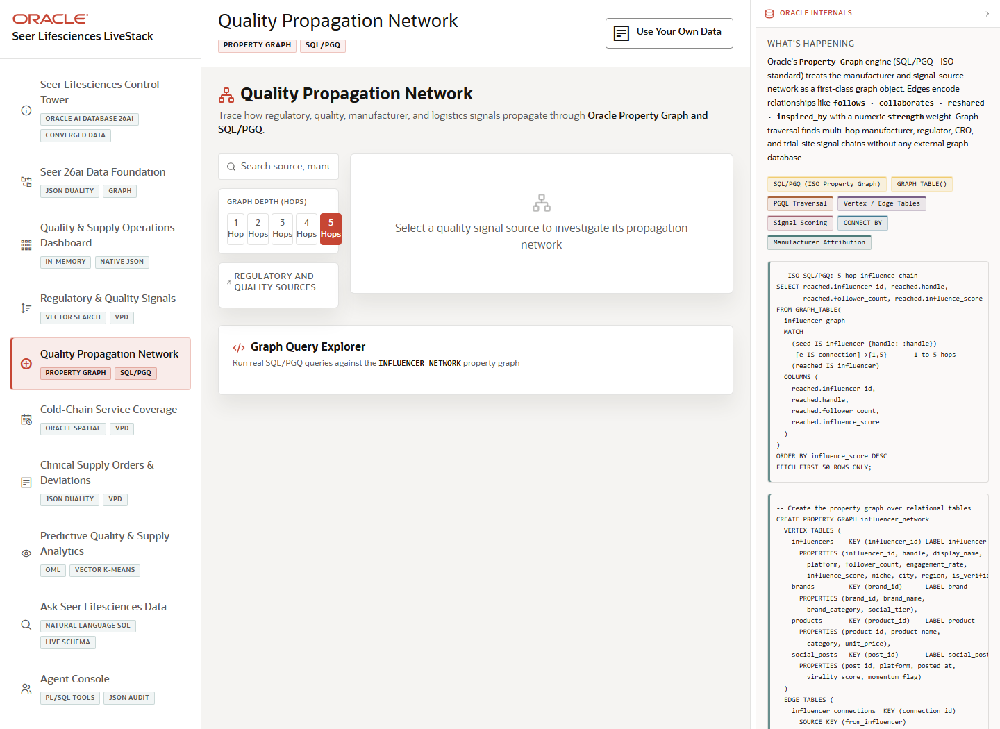

# Scene 5 Quality Propagation Network

## Introduction

The propagation network scene turns product, manufacturer, supplier, trial site, and quality event relationships into an interactive graph so the presenter can show how one quality signal may affect connected entities.

Estimated Time: 10 minutes



### Objectives

In this lab, you will:
- Search and select graph entities that represent products, sites, manufacturers, or quality events.
- Change graph depth to inspect relationship expansion.
- Run example graph queries to explain SQL/PGQ and property graph analysis.

## Task 1: Explore a connected entity

1. Select **Quality Propagation Network**.
2. Search for a product, manufacturer, site, or quality event in the left panel.
3. Select an entity and review the graph visualization.
4. Use the depth controls to compare immediate relationships against expanded propagation paths.

Expected result:
- The selected entity is centered in a visual relationship map.
- The audience can see how a quality or supply issue propagates through related products, sites, manufacturers, and events.

## Task 2: Run a graph query example

1. Open the graph query explorer in the page.
2. Choose an example query and review its parameters.
3. Click the run control and compare the result table or visualization to the visible network.

Expected result:
- The scene connects an operator-friendly graph view to executable database graph queries.
- The presenter can describe how SQL/PGQ helps detect relationship risk without exporting data to a separate graph store.

## Task 3: Why this matters?

A quality issue rarely stays isolated. Graph analysis helps teams understand second-order effects, affected partners, and response priorities, while keeping the analysis close to governed operational data.

## Credits & Build Notes
- **Author** - LiveLabs Team
- **Last Updated By/Date** - LiveLabs Team, 2026-05-13
- **Source LiveStack** - livestack-lifesciences.zip
