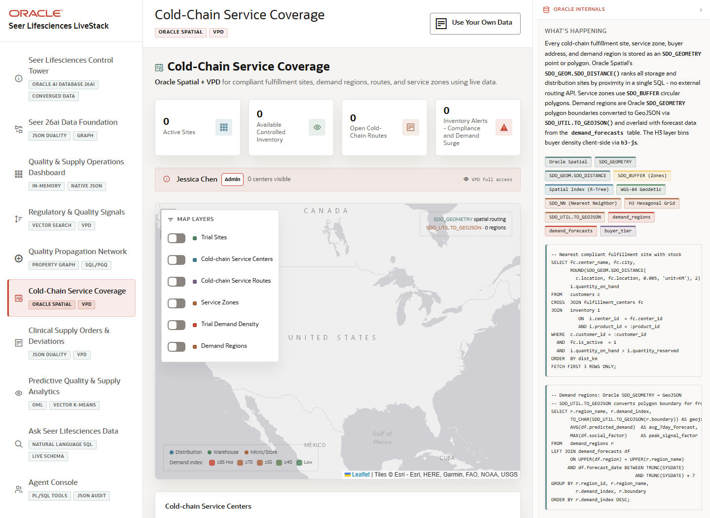

# Scene 6 Cold-Chain Service Coverage

## Introduction

The cold-chain scene uses Oracle Spatial-backed data to show service centers, trial sites, shipment activity, demand regions, H3-style heat, and SLA zones for regulated supply routing.

Estimated Time: 10 minutes



### Objectives

In this lab, you will:
- Inspect cold-chain service centers and shipment overlays.
- Toggle map layers for trial sites, demand regions, service zones, and heat indicators.
- Explain how spatial distance and governed row policies support fulfillment decisions.

## Task 1: Inspect service coverage

1. Select **Cold-Chain Service Coverage**.
2. Review the service center list and the map overlays.
3. Toggle layers such as cold-chain centers, trial sites, demand regions, SLA zones, and shipment paths to show different operational views.

Expected result:
- The map shows where clinical supply can be served and which geographies may need attention.
- The presenter can connect visible coverage to Oracle Spatial capabilities and VPD-aware access.

## Task 2: Use the nearest-site workflow

1. Use the nearest fulfillment or routing controls when the full backend is running.
2. Select or enter a trial site and a product where the UI allows it.
3. Compare the proposed service center, inventory status, distance, and expected delivery signal.

Expected result:
- The operator sees which cold-chain site can serve a trial site with the least operational risk.
- The scene demonstrates spatial routing as a practical decision aid, not just a map.

## Task 3: Why this matters?

Cold-chain logistics decisions need geography, capacity, inventory, and compliance context together. This scene shows how Oracle Spatial can help guide service coverage and routing while remaining part of the same application data model.

## Credits & Build Notes
- **Author** - LiveLabs Team
- **Last Updated By/Date** - LiveLabs Team, 2026-05-13
- **Source LiveStack** - livestack-lifesciences.zip
