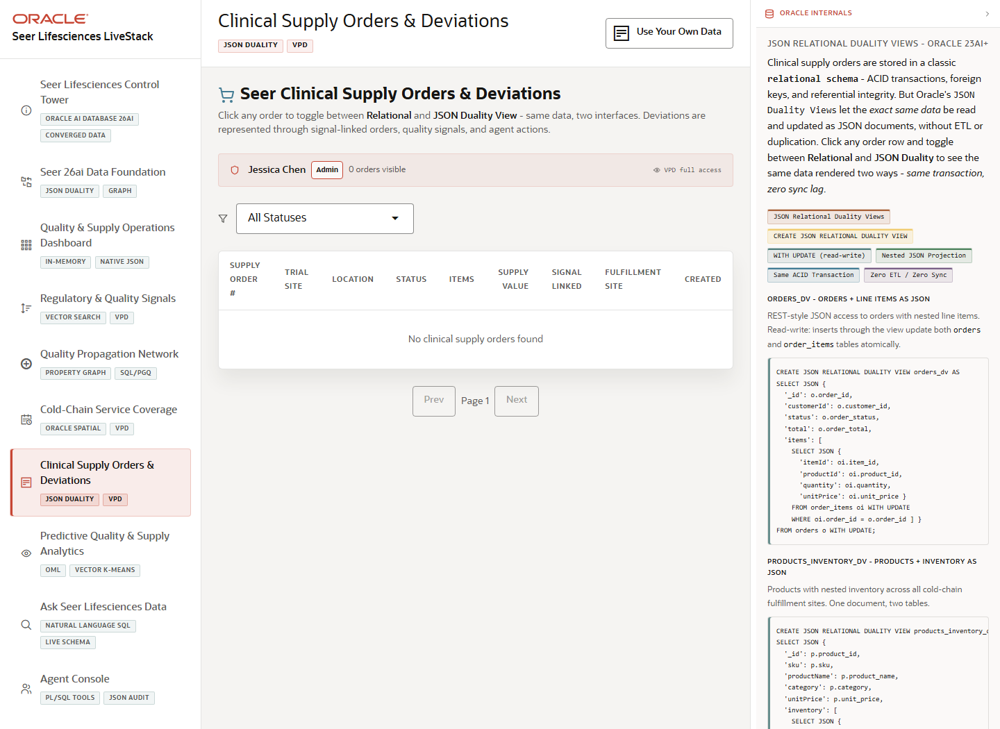

# Scene 7 Clinical Supply Orders and Deviations

## Introduction

The orders scene focuses on clinical supply transactions, deviations, route status, JSON duality views, and VPD behavior that limits which orders a user can see.

Estimated Time: 10 minutes



### Objectives

In this lab, you will:
- Filter and page through clinical supply orders.
- Open an order and compare relational, JSON, and route views.
- Use the user switcher to discuss row-level security behavior.

## Task 1: Review clinical supply orders

1. Select **Clinical Supply Orders & Deviations**.
2. Use the status filter to narrow the order table by fulfillment or deviation state.
3. Use **Prev** and **Next** to page through the order list if enough rows are loaded.

Expected result:
- The operator sees clinical supply orders with trial site, status, supply value, product, and fulfillment site context.
- The page provides a transaction-level view of the same regulated operations story introduced in the dashboard.

## Task 2: Open order detail

1. Select an order row when the data-backed stack is running.
2. Review the **Relational**, **JSON Document**, and **Cold-Chain Route** tabs in the detail panel.
3. Use the **Driving Route** control when route geometry is available to compare straight-line and routed distance.

Expected result:
- The audience sees that the order can be inspected as normalized relational data, JSON document data, and spatial route evidence.
- The route tab turns Oracle Spatial results into operational context for cold-chain delivery decisions.

## Task 3: Why this matters?

Regulated supply teams need both transaction detail and access control. This scene demonstrates how JSON duality, spatial routing, and VPD can support application workflows without creating separate data copies.

## Credits & Build Notes
- **Author** - LiveLabs Team
- **Last Updated By/Date** - LiveLabs Team, 2026-05-13
- **Source LiveStack** - livestack-lifesciences.zip
