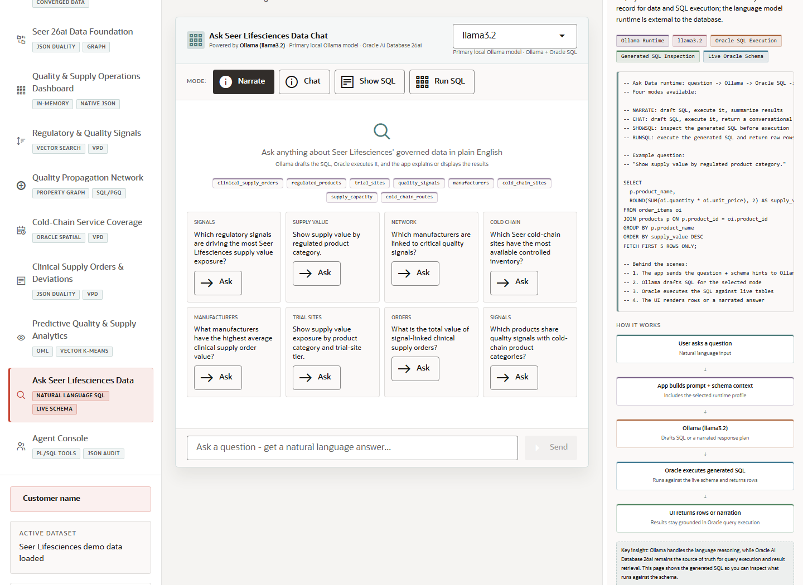

# Scene 9 Ask Seer Lifesciences Data

## Introduction

Ask Data lets a user ask plain-English questions over the governed life sciences schema. The runtime can narrate, show SQL, run SQL, or provide a conversational answer while Oracle remains the execution source of truth.

Estimated Time: 10 minutes



### Objectives

In this lab, you will:
- Ask natural-language questions over the live schema.
- Switch between Narrate, Show SQL, Run SQL, and Chat modes.
- Inspect generated SQL before using results in a business conversation.

## Task 1: Choose a query mode

1. Select **Ask Seer Lifesciences Data**.
2. Review the active runtime profile selector.
3. Choose **Show SQL** when you want to inspect generated SQL before execution, or **Run SQL** when you want rows returned to the UI.

Expected result:
- The presenter can control whether the audience sees narration, generated SQL, executed rows, or a conversational answer.
- The UI makes clear that Oracle executes the SQL against the live schema.

## Task 2: Ask a governed data question

1. Enter a question such as `Which critical products have low inventory?` or choose an example question.
2. Click **Send**.
3. Review the answer, generated SQL, and any returned table rows.

Expected result:
- The app returns an answer grounded in Oracle-backed schema context and query execution.
- The presenter can show how natural-language access helps business users explore regulated operations data while keeping database execution visible.

## Task 3: Why this matters?

Natural-language access is valuable only when it stays grounded in trusted data and visible SQL. This scene demonstrates how an AI-assisted interface can support governed exploration instead of bypassing database controls.

## Credits & Build Notes
- **Author** - LiveLabs Team
- **Last Updated By/Date** - LiveLabs Team, 2026-05-13
- **Source LiveStack** - livestack-lifesciences.zip
