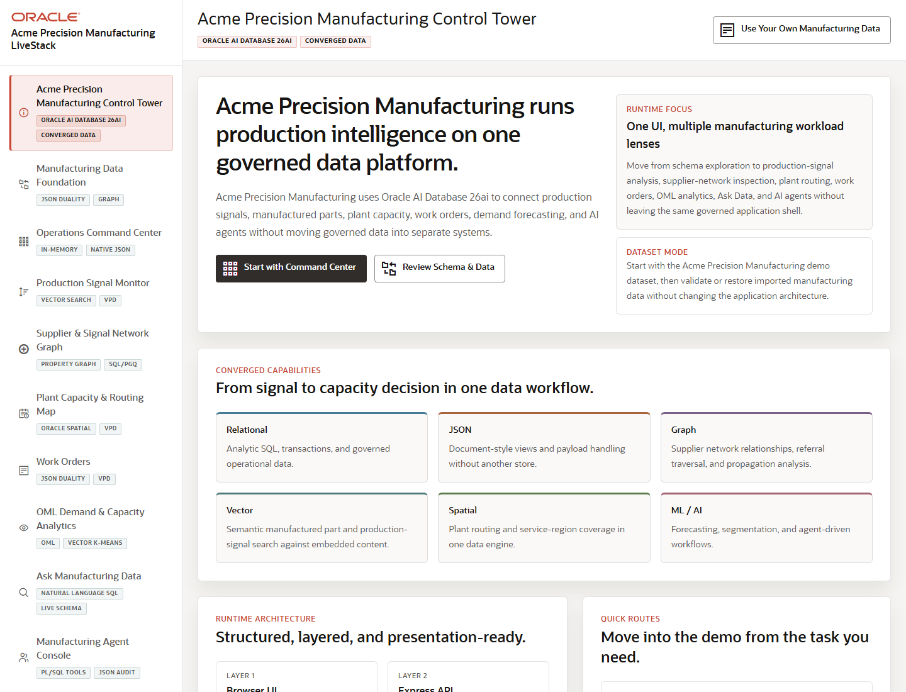

# Scene 1 Control Tower Orientation

## Introduction

This scene introduces Acme Precision Manufacturing and frames the LiveStack as one control tower for production, demand, supplier, inventory, routing, work order, analytics, and agent workflows. Use it to set the audience context before moving into the individual operator screens.

Estimated Time: 8 minutes

### Objectives

In this lab, you will:
- Open the control tower landing screen.
- Review the converged Oracle workload lenses.
- Use the quick routes to move into the first operational workflow.

## Task 1: Open the Control Tower

1. Open the Manufacturing Operations LiveStack application.
2. Confirm the left navigation shows the Acme Precision Manufacturing LiveStack brand.
3. Review the landing page sections for runtime focus, converged capabilities, runtime architecture, and quick routes.

Expected result:
- The page describes a manufacturing operations demo centered on production signals, plant capacity, routing, and AI-assisted action.
- The architecture panel shows Browser UI, Express API, Oracle AI Database 26ai, and REST plus local AI services.

## Task 2: Review the Oracle Workload Lenses

1. Inspect the capability cards for Relational, JSON, Graph, Vector, Spatial, and ML / AI.
2. Explain that the application uses one database platform to support operational transactions, documents, relationships, semantic search, geospatial routing, and analytics.
3. Point out that each subsequent scene uses the same application shell but emphasizes a different workload.

Expected result:
- The audience understands that the demo is not a collection of disconnected point tools.
- The control tower becomes the story map for the rest of the walkthrough.

## Task 3: Move Into the Demo

1. Click **Open command center** or select **Operations Command Center** in the left navigation.
2. Return to the control tower when needed by selecting **Acme Precision Manufacturing Control Tower**.

Expected result:
- The active navigation item changes and the app moves to the selected workflow.
- The browser URL updates with the selected page when a workflow is opened.

## Task 4: Why this matters?

Manufacturing operations leaders need a concise way to understand how demand, production signals, plant capacity, supplier relationships, and AI actions connect. The control tower gives the presenter a shared map before asking the audience to inspect individual screens.

## Credits & Build Notes
- **Author** - LiveLabs Team
- **Last Updated By/Date** - LiveLabs Team, 2026-05-13
