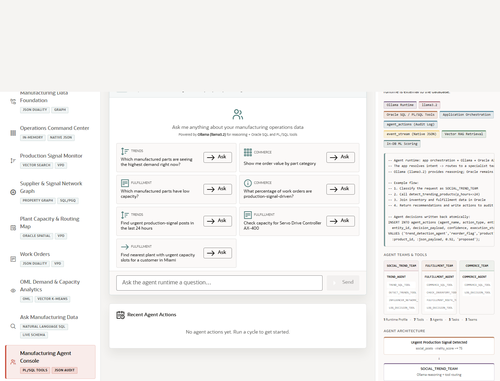

# Scene 10 Manufacturing Agent Console

## Introduction

This scene demonstrates agent-assisted manufacturing operations. Use it to show how the app can coordinate PL/SQL-backed tools, JSON audit trails, team activity, and chat-style operations assistance.

Estimated Time: 12 minutes

### Objectives

In this lab, you will:
- Open the Manufacturing Agent Console.
- Ask an agent question or run an agent cycle.
- Review event history, tool history, team activity, and action audit evidence.

## Task 1: Open the Agent Console

1. Select **Manufacturing Agent Console** in the left navigation.
2. Review the workload tags for PL/SQL Tools and JSON Audit.
3. Locate the chat panel, agent activity panels, and summary metrics.

Expected result:
- The scene presents agent operations as an auditable manufacturing workflow.
- The visible panels separate user questions, tool calls, actions, and team history.

## Task 2: Ask or Run an Agent Workflow

1. Type a manufacturing operations question in the chat input, such as `Which capacity risks should we address first?`
2. Click the send action, or use an example prompt if available.
3. If the page exposes a run-cycle or detect-trends action, click it and watch the activity stream update.

Expected result:
- In a full stack run, the agent workflow returns a recommendation, logs tool usage, and records an auditable action trail.
- The user can explain which data or tool evidence supported the recommendation.

## Task 3: Inspect Audit and Team Evidence

1. Review recent events, tool history, team execution history, and action audit panels.
2. Compare agent recommendations against dashboard, graph, routing, or OML evidence from earlier scenes.
3. Use the Oracle internals panel to explain how PL/SQL tools and JSON audit data support governance.

Expected result:
- The agent workflow feels connected to the rest of the LiveStack rather than isolated from operational data.
- The presenter can explain auditability and operator trust.

## Task 4: Why this matters?

Manufacturing teams need AI assistance that produces traceable recommendations, not opaque chat. This console shows how agents can call database-backed tools, record actions, and keep the operator in control.

## Credits & Build Notes
- **Author** - LiveLabs Team
- **Last Updated By/Date** - LiveLabs Team, 2026-05-13
