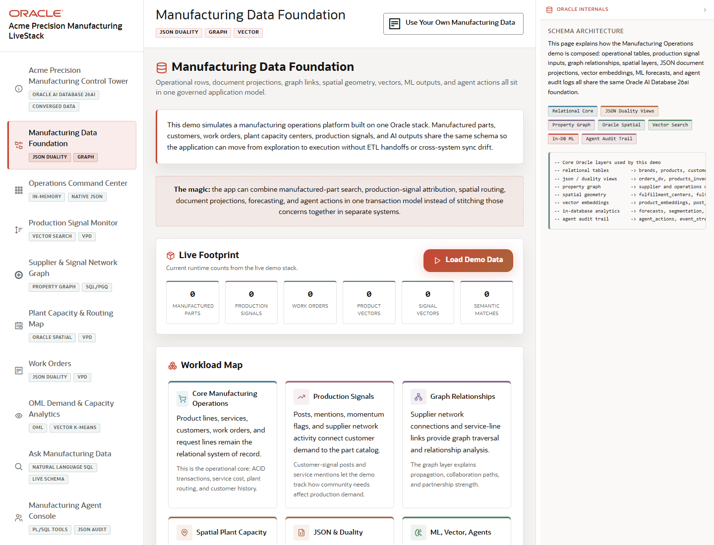

# Scene 2 Manufacturing Data Foundation

## Introduction

This scene explains the data foundation behind the demo. It is the right place to show how the application models manufacturing operations across relational tables, JSON duality views, graph relationships, vector embeddings, spatial data, security policies, and AI profiles.

Estimated Time: 10 minutes

### Objectives

In this lab, you will:
- Open the Manufacturing Data Foundation screen.
- Review the schema and workload model.
- Connect the visible data model to the later operator workflows.

## Task 1: Open the Data Foundation

1. Select **Manufacturing Data Foundation** in the left navigation.
2. Review the page title and the workload tags for JSON Duality, Graph, and Vector.
3. Inspect the visible cards and data-model sections.

Expected result:
- The scene opens with a data foundation view for the manufacturing demo.
- The visible content positions Oracle AI Database 26ai as the common data layer for the later application screens.

## Task 2: Explain the Workload Map

1. Point out the manufacturing entities represented by the app, such as products, inventory, demand forecasts, fulfillment centers, work orders, social or production signals, influencers, and agent actions.
2. Highlight where JSON document views simplify nested product or work order payloads.
3. Highlight where graph, vector, spatial, and OML data support supplier network analysis, semantic search, routing, and forecasting.

Expected result:
- The audience can see how the app avoids moving data into separate databases for each workload.
- The data model becomes the evidence base for the operational scenes that follow.

## Task 3: Connect Data Foundation to Security and Runtime

1. Review any visible notes about VPD, ORDS, SQL/PGQ, vector search, or AI profiles.
2. Explain that the same application can switch demo users and apply governed access patterns.
3. Use the right-side Oracle internals panel to show the SQL or architecture evidence when useful.

Expected result:
- The presenter can describe the data foundation without leaving the application.
- The audience understands that security, APIs, and analytics are part of the same operating model.

## Task 4: Why this matters?

Manufacturing teams often have separate systems for orders, plant capacity, supplier relationships, analytics, and AI experimentation. This scene shows how Oracle AI Database can anchor those workloads in one governed operational foundation.

## Credits & Build Notes
- **Author** - LiveLabs Team
- **Last Updated By/Date** - LiveLabs Team, 2026-05-13
