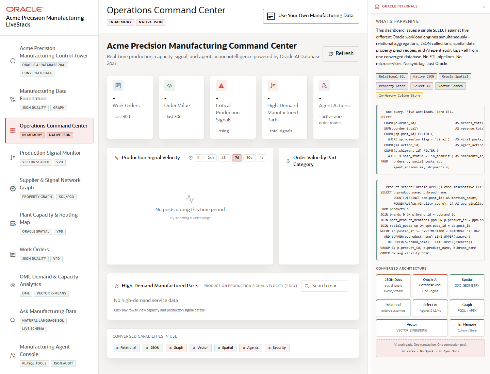

# Scene 3 Operations Command Center

## Introduction

This scene is the executive and operator dashboard for current manufacturing conditions. It brings together work orders, order value, critical production signals, high-demand manufactured parts, and agent actions.

Estimated Time: 10 minutes

### Objectives

In this lab, you will:
- Open the Operations Command Center.
- Refresh and inspect the KPI cards.
- Review signal velocity, order value, product demand, and converged capability evidence.

## Task 1: Open the Command Center

1. Select **Operations Command Center** in the left navigation.
2. Review the KPI cards for Work Orders, Order Value, Critical Production Signals, High-Demand Manufactured Parts, and Agent Actions.
3. Inspect the **What's Happening** panel on the right.

Expected result:
- The dashboard presents a compact operations summary for Acme Precision Manufacturing.
- The right panel explains that the view is assembled through one SELECT over multiple Oracle workload engines.

## Task 2: Refresh and Inspect the Operational Signals

1. Click **Refresh**.
2. Review the Production Signal Velocity chart and the time range controls.
3. Inspect Order Value by Part Category and the High-Demand Manufactured Parts table.
4. Use the search field in the high-demand table if populated data is available.

Expected result:
- The dashboard updates its visible state after refresh.
- The presenter can explain whether demand, capacity, signals, and agent actions indicate a stable or stressed manufacturing environment.

## Task 3: Use the Oracle Internals Panel

1. Review the tags for In-Memory, Native JSON, Oracle Spatial, Property Graph, Select AI, and Vector Search.
2. Inspect the SQL snippets and converged architecture blocks.
3. Compare the dashboard cards to the Oracle capabilities listed in the panel.

Expected result:
- The audience sees a direct line from dashboard metrics to Oracle-backed query and data services.
- The dashboard becomes a business view rather than a generic analytics screen.

## Task 4: Why this matters?

Operators need to see which demand and production signals deserve attention before they drill into root cause. This command center consolidates the manufacturing state and prepares the presenter to move from summary to investigation.

## Credits & Build Notes
- **Author** - LiveLabs Team
- **Last Updated By/Date** - LiveLabs Team, 2026-05-13
