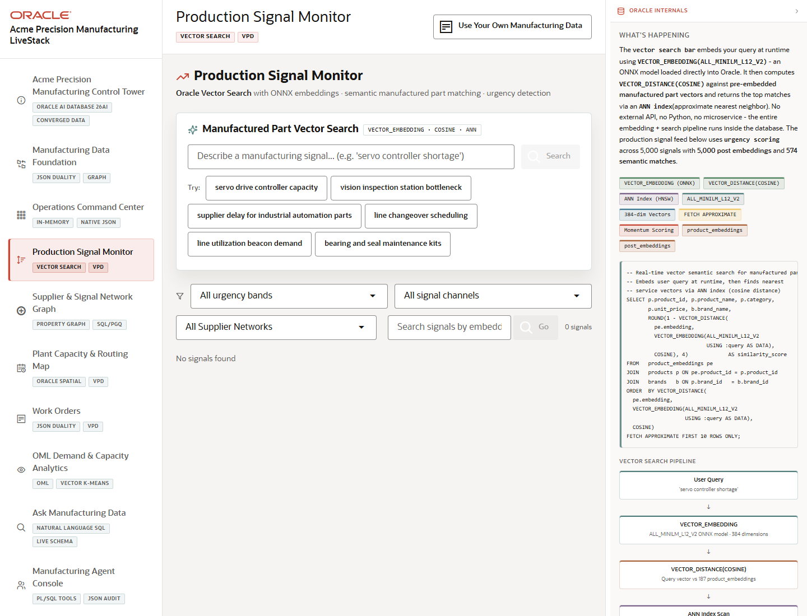

# Scene 4 Production Signal Monitor

## Introduction

This scene focuses on production signals and semantic manufactured-part search. Use it to show how operators can inspect production chatter, supplier context, and demand-related signal patterns with vector search and governed access.

Estimated Time: 10 minutes

### Objectives

In this lab, you will:
- Open the Production Signal Monitor.
- Use manufactured-part vector search examples.
- Review production signal filters, pagination, and result cards.

## Task 1: Open the Production Signal Monitor

1. Select **Production Signal Monitor** in the left navigation.
2. Review the page title, vector search workload tag, and VPD tag.
3. Locate the **Manufactured Part Vector Search** panel.

Expected result:
- The scene opens to a production-signal workflow that connects semantic search to manufacturing operations.
- The audience can see where vector search complements normal filters.

## Task 2: Run a Manufactured-Part Search

1. Type a manufacturing-oriented phrase into the vector search input, such as `precision spindle vibration` or use one of the example buttons if visible.
2. Click the search action.
3. Review the returned similarity scores, part names, categories, or related signal evidence when the full stack is running.

Expected result:
- The search interaction sends the phrase to the semantic search endpoint.
- Returned results are ranked by meaning rather than exact keyword matching when database services are available.

## Task 3: Review Production Signal Cards

1. Use the signal search controls and filters to narrow the feed.
2. Move between pages with **Prev** and **Next** if enough results are present.
3. Inspect urgency, source channel, momentum, and supplier or part references on the visible cards.

Expected result:
- The feed helps the presenter explain what production or supplier signal should trigger action.
- VPD and Oracle vector search can be tied back to governed signal monitoring.

## Task 4: Why this matters?

Manufacturing signals are messy and often use different words for the same issue. Vector search helps operators find semantically related part and production risk signals without building brittle keyword lists.

## Credits & Build Notes
- **Author** - LiveLabs Team
- **Last Updated By/Date** - LiveLabs Team, 2026-05-13
