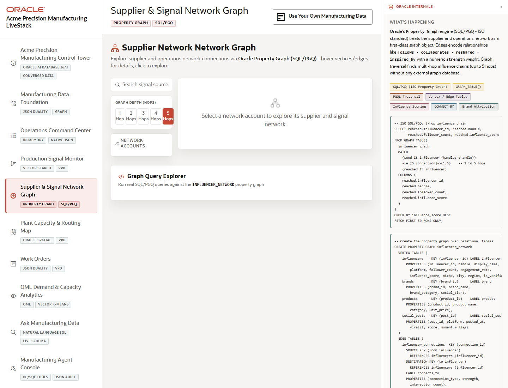

# Scene 5 Supplier and Signal Network Graph

## Introduction

This scene visualizes supplier, influencer, and production-signal relationships as a graph. Use it to explain how the demo follows relationship paths rather than treating each signal as an isolated row.

Estimated Time: 10 minutes

### Objectives

In this lab, you will:
- Open the Supplier and Signal Network Graph.
- Explore graph depth and node details.
- Run graph query examples and inspect SQL/PGQ evidence.

## Task 1: Open the Network Graph

1. Select **Supplier & Signal Network Graph** in the left navigation.
2. Review the workload tags for Property Graph and SQL/PGQ.
3. Locate the graph canvas, search control, depth selector, and graph query explorer.

Expected result:
- The scene presents a relationship-oriented view of manufacturing signal propagation.
- The graph tools let the presenter move from a visible node to connected suppliers, signals, or related entities.

## Task 2: Explore Nodes and Depth

1. Search for an available supplier, signal, or influencer node when data is loaded.
2. Change the depth selector from a shallow view to a deeper graph traversal.
3. Click a node to open its detail panel, then use **Explore Network** if available.

Expected result:
- The graph expands or refocuses around the selected node.
- The detail panel gives enough context to explain why the relationship matters.

## Task 3: Run a Graph Query Example

1. Select an example from the Graph Query Explorer.
2. Click the run action.
3. Open the SQL or query evidence if the panel provides a toggle.

Expected result:
- The app returns graph results and displays the query pattern that produced them.
- The presenter can explain how SQL/PGQ supports path and relationship analysis inside Oracle Database.

## Task 4: Why this matters?

Supplier risk, production signal propagation, and operational influence rarely follow simple one-table logic. Graph traversal helps teams find connected risk paths and explain why one signal can affect multiple parts, suppliers, or regions.

## Credits & Build Notes
- **Author** - LiveLabs Team
- **Last Updated By/Date** - LiveLabs Team, 2026-05-13
