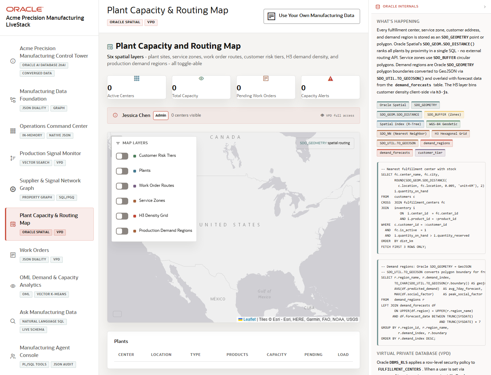

# Scene 6 Plant Capacity and Routing Map

## Introduction

This scene uses spatial data to connect demand regions, plant capacity centers, shipments, and inventory alerts. Use it to show how manufacturing operations can reason about geography, service coverage, and routing decisions inside the same application.

Estimated Time: 10 minutes

### Objectives

In this lab, you will:
- Open the Plant Capacity and Routing Map.
- Inspect capacity centers, demand regions, shipments, and inventory alerts.
- Use routing controls to evaluate nearest or best-fit capacity options.

## Task 1: Open the Routing Map

1. Select **Plant Capacity & Routing Map** in the left navigation.
2. Review the workload tags for Oracle Spatial and VPD.
3. Inspect the map, capacity center cards, demand regions, and alert panels.

Expected result:
- The scene presents plant capacity and routing as a geographic decision workflow.
- The right-side evidence connects the visible map to Oracle Spatial and governed access.

## Task 2: Evaluate a Routing Scenario

1. Select or review a customer, product, or demand region when controls are populated.
2. Run the nearest-capacity or routing action if available.
3. Compare the recommended route to inventory alerts, in-transit shipments, and regional demand.

Expected result:
- The map highlights the relevant plant or fulfillment center decision.
- Operators can explain why the selected route is operationally attractive or risky.

## Task 3: Inspect Capacity and Demand Evidence

1. Review any H3, zone, or region heat indicators shown in the scene.
2. Compare capacity center utilization against production signal or demand-pressure indicators.
3. Use the Oracle internals panel to connect spatial calculations to the visible route.

Expected result:
- The user sees geography and capacity as part of the same operating decision.
- The scene sets up downstream work order and analytics conversations.

## Task 4: Why this matters?

Manufacturing decisions depend on where inventory, plant capacity, and demand are located. Spatial analysis helps operators route work and shipments with better context than a flat order list can provide.

## Credits & Build Notes
- **Author** - LiveLabs Team
- **Last Updated By/Date** - LiveLabs Team, 2026-05-13
