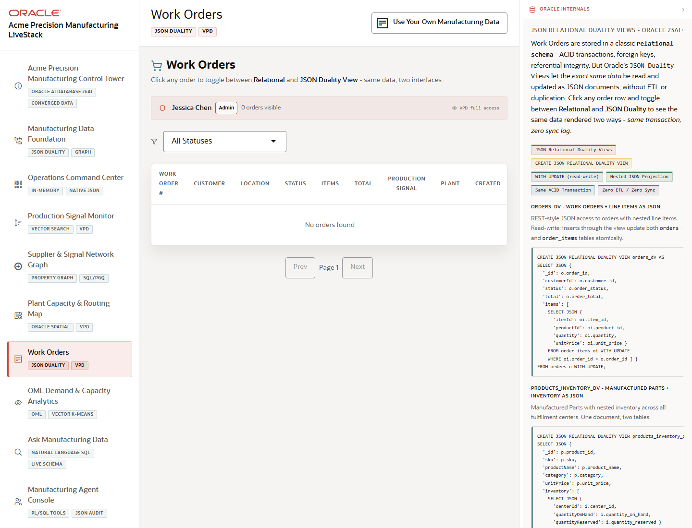

# Scene 7 Work Orders and JSON Duality

## Introduction

This scene demonstrates work order operations and JSON Duality. Use it to show how an operator can inspect structured work order records, route details, and JSON document views without maintaining a separate document database.

Estimated Time: 10 minutes

### Objectives

In this lab, you will:
- Open the Work Orders screen.
- Filter or inspect work order rows.
- Open the JSON Duality panel for a selected work order.

## Task 1: Open Work Orders

1. Select **Work Orders** in the left navigation.
2. Review the workload tags for JSON Duality and VPD.
3. Inspect the visible work order list, route or map context, and VPD explanation.

Expected result:
- The scene presents work orders as an operational list with security and document-view context.
- The audience can connect work order visibility to region or role-based access.

## Task 2: Inspect a Work Order

1. Select a work order row when data is loaded.
2. Review customer, product, status, routing, and shipment details.
3. Open the JSON Duality or document action for that order.

Expected result:
- The selected work order opens with a nested JSON-style representation.
- The same business object can be explained as both relational data and an application-friendly document.

## Task 3: Compare VPD and Document Evidence

1. Review the VPD policy explanation or SQL shown in the scene.
2. Compare which records are visible for the active demo user.
3. Use the JSON document view to show how application payloads can stay consistent with relational truth.

Expected result:
- The presenter can explain governed access and document APIs in the same scene.
- The audience sees JSON Duality as an operational simplification, not a separate data silo.

## Task 4: Why this matters?

Manufacturing teams need work order payloads that are easy for applications to consume while still preserving transactional consistency and security. JSON Duality lets the demo show both without duplicating the data model.

## Credits & Build Notes
- **Author** - LiveLabs Team
- **Last Updated By/Date** - LiveLabs Team, 2026-05-13
