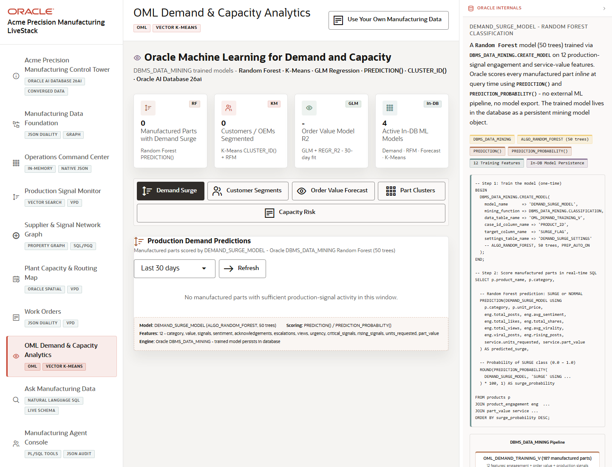

# Scene 8 OML Demand and Capacity Analytics

## Introduction

This scene demonstrates Oracle Machine Learning and vector clustering for manufacturing demand and capacity intelligence. Use it to connect forecasts, segments, semantic part clusters, and capacity risk into one analytics workflow.

Estimated Time: 12 minutes

### Objectives

In this lab, you will:
- Open OML Demand and Capacity Analytics.
- Review the available analytic tabs and model evidence.
- Run or inspect demand forecasts, segment filters, vector clusters, and capacity intelligence.

## Task 1: Open OML Analytics

1. Select **OML Demand & Capacity Analytics** in the left navigation.
2. Review the workload tags for OML and Vector K-Means.
3. Inspect the summary metrics and analytic tabs.

Expected result:
- The scene presents OML as an in-database analytics workflow tied to manufacturing demand and capacity.
- The presenter can point to specific tabs rather than describing analytics abstractly.

## Task 2: Review Forecast and Segmentation Workflows

1. Open the demand forecast tab or section.
2. Review forecasted demand, revenue opportunity, model details, and time windows when data is available.
3. Open customer or account segmentation and use available segment filters.

Expected result:
- The analytics view explains how demand and account patterns can influence production decisions.
- The model evidence remains visible enough to support a credible technical discussion.

## Task 3: Inspect Vector Clusters and Capacity Intelligence

1. Open the manufactured-part vector clustering view.
2. Adjust the cluster count if the K control is available, then run or refresh the cluster workflow.
3. Open capacity intelligence and review critical, at-risk, surge, and margin-at-risk indicators.

Expected result:
- The app groups manufactured parts by semantic similarity using vector distance.
- Capacity intelligence translates forecast and inventory signals into operational risk indicators.

## Task 4: Why this matters?

Manufacturing analytics only matter when they influence action. This scene shows how OML forecasts, vector clusters, and capacity scoring can move the conversation from reporting to capacity planning and risk mitigation.

## Credits & Build Notes
- **Author** - LiveLabs Team
- **Last Updated By/Date** - LiveLabs Team, 2026-05-13
