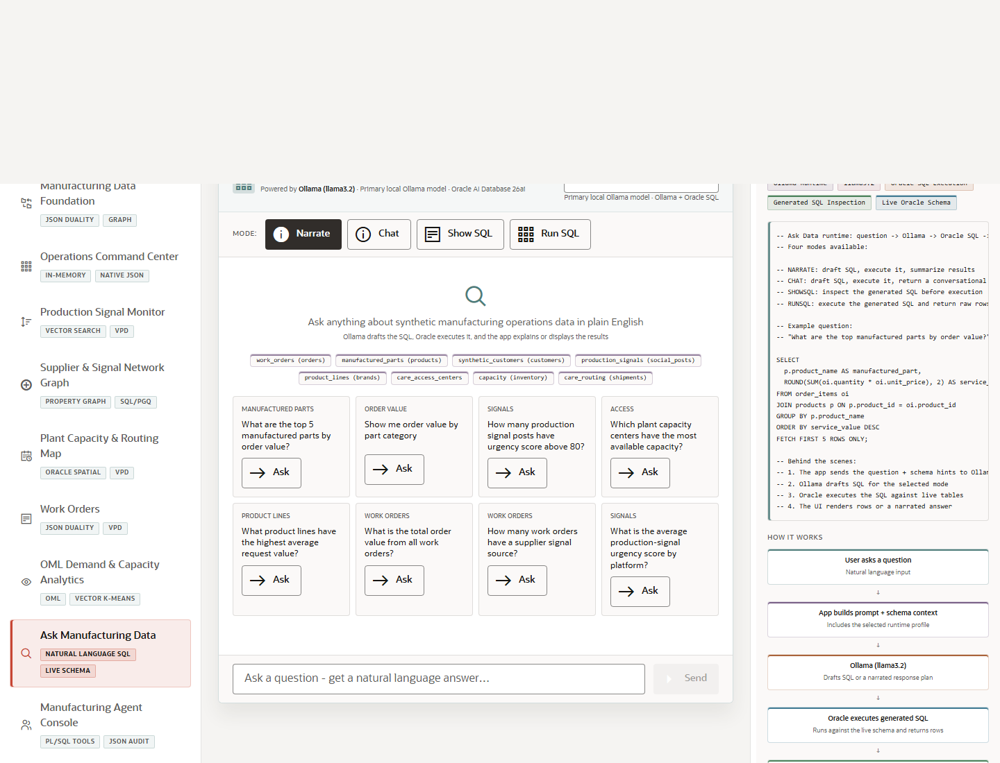

# Scene 9 Ask Manufacturing Data

## Introduction

This scene demonstrates natural-language questions over live manufacturing operations data. The app routes a user question through an Ollama-backed language workflow, schema context, and Oracle SQL execution modes.

Estimated Time: 10 minutes

### Objectives

In this lab, you will:
- Open Ask Manufacturing Data.
- Compare Narrate, Chat, Show SQL, and Run SQL modes.
- Ask a question and inspect the generated answer or SQL evidence.

## Task 1: Open Ask Manufacturing Data

1. Select **Ask Manufacturing Data** in the left navigation.
2. Review the **What's Happening** and **How It Works** panels.
3. Locate the mode buttons for **Narrate**, **Chat**, **Show SQL**, and **Run SQL**.

Expected result:
- The scene explains that Ollama handles language reasoning while Oracle AI Database remains the system of record for data and SQL execution.
- The user can choose how much SQL evidence to expose.

## Task 2: Ask a Manufacturing Question

1. Select **Narrate** or **Show SQL**.
2. Choose one of the example questions or type a question such as `Which manufactured parts have the highest capacity risk?`
3. Click the send action.

Expected result:
- The app sends the question with schema context and the selected runtime profile.
- In a full stack run, the answer includes generated SQL, narrative output, or rows depending on the selected mode.

## Task 3: Compare Modes

1. Switch to **Show SQL** and ask the same question.
2. Switch to **Run SQL** and run a question that returns rows.
3. Use **View generated SQL** when the response includes a collapsible SQL section.

Expected result:
- The presenter can show how the same user question supports executive narration, conversational detail, SQL transparency, and data-returning execution.
- The mode switch makes natural-language data access safe to explain to technical and business audiences.

## Task 4: Why this matters?

Operations users often know the question before they know the schema. This scene shows how natural-language access can reduce friction while still keeping Oracle SQL, schema context, and governed execution in the loop.

## Credits & Build Notes
- **Author** - LiveLabs Team
- **Last Updated By/Date** - LiveLabs Team, 2026-05-13
