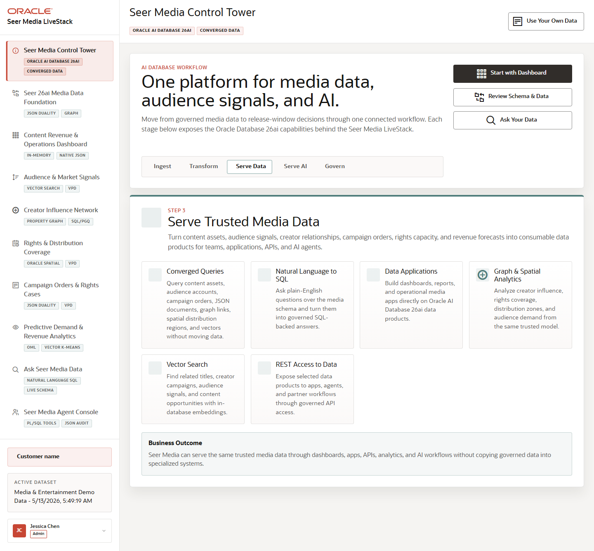

# Scene 1 Seer Media Control Tower

## Introduction

This scene orients the user to the Seer Media LiveStack. The opening screen frames Oracle AI Database 26ai as the platform behind media data products, audience signals, graph and spatial analytics, vector search, REST access, and natural-language SQL.

Estimated Time: 8 minutes

### Objectives

In this lab, you will:
- Open the Seer Media landing scene.
- Identify the major Oracle capability areas.
- Use the primary actions to move into the data model, dashboard, or Ask Data workflow.

## Task 1: Open the control tower

1. Open the running LiveStack application.
2. Confirm the header says **One platform for media data, audience signals, and AI.**
3. Review the workflow stages and the capability cards.

Expected result:
- The landing scene explains the end-to-end Seer Media story.
- The user sees the main entry points: data model, dashboard, and Ask Data.

## Task 2: Use the primary navigation

1. Click **Explore Data Model**.
2. Return to the landing scene from the left navigation.
3. Click **Start Dashboard**.
4. Return again and click **Ask Your Data**.

Expected result:
- The app changes scenes without leaving the single application shell.
- Each click moves to a real workflow backed by the same Oracle data foundation.

## Task 3: Why this matters?

The opening scene keeps the demo from feeling like disconnected point features. It establishes the business narrative: Seer Media can run content intelligence, engagement analysis, operational coverage, predictive analytics, and agent-assisted decisions on one governed Oracle-backed platform.

## Credits & Build Notes
- **Author** - Oracle LiveStack Team
- **Last Updated By/Date** - Oracle LiveStack Team, 2026-05-13
