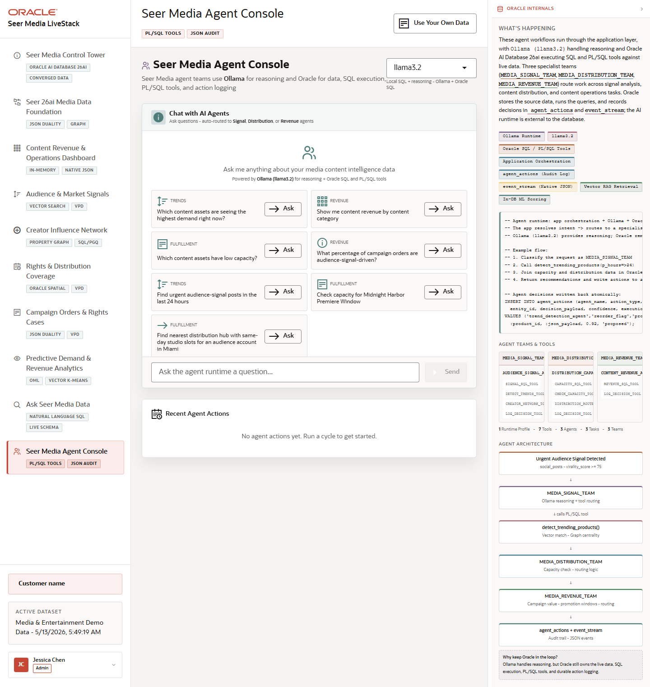

# Scene 10 Seer Media Agent Console

## Introduction

This scene demonstrates agent-assisted media operations. The console routes questions to specialist signal, distribution, and revenue agents while Oracle owns SQL execution, PL/SQL tools, and the action log.

Estimated Time: 10 minutes

### Objectives

In this lab, you will:
- Select or review the active agent runtime profile.
- Ask an agent workflow question.
- Inspect recent agent actions and the Oracle-backed audit trail.

## Task 1: Ask an agent question

1. Open **Seer Media Agent Console**.
2. Review the runtime profile selector.
3. Click **Ask** beside an example question, or type a question into **Ask the agent runtime a question...**.
4. Click **Send**.

Expected result:
- The app routes the question to the appropriate media signal, distribution, or revenue path.
- The visible response summarizes the agent action and supporting data.

## Task 2: Review recent agent actions

1. Scroll to **Recent Agent Actions**.
2. Review the action type, agent name, entity, and status.
3. Compare the action history with the answer produced by the agent.

Expected result:
- The user sees that agent work is not a black box.
- Decisions and tool usage are visible as auditable application data.

## Task 3: Inspect the Oracle internals

1. Open or review **How Oracle Powers This**.
2. Look for Ollama runtime, Oracle SQL and PL/SQL tools, `agent_actions`, `event_stream`, vector retrieval, and in-database scoring.

Expected result:
- The user can explain that the LLM handles reasoning, while Oracle remains the data, tools, policy, and audit layer.

## Task 4: Why this matters?

Agent demos are strongest when they show control and evidence. This scene makes the agent workflow explainable: routing, SQL tools, PL/SQL actions, and audit logs are tied back to governed Seer Media data.

## Credits & Build Notes
- **Author** - Oracle LiveStack Team
- **Last Updated By/Date** - Oracle LiveStack Team, 2026-05-13
