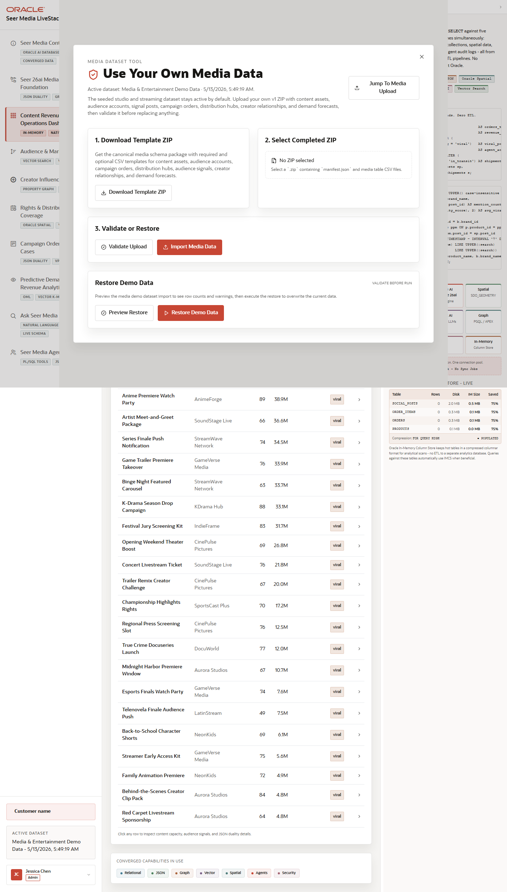

# Scene 11 Use Your Own Data

## Introduction

This operator workflow lets a user download a dataset template, validate a completed ZIP, load replacement data, or restore the bundled demo data. It is the handoff point between a polished demo and a customer-specific proof path.

Estimated Time: 10 minutes

### Objectives

In this lab, you will:
- Open the data import overlay.
- Download the import template.
- Validate a completed dataset ZIP or restore demo data.

## Task 1: Open the import workflow

1. From any main app scene, click **Use Your Own Data** in the top bar.
2. Review the modal workflow.
3. Note the current active dataset label in the sidebar.

Expected result:
- The import overlay opens without leaving the current app context.
- The workflow shows template download, ZIP selection, validation, upload, and restore controls.

## Task 2: Download and validate a template

1. Click **Download Template ZIP**.
2. Open the template outside the app and review the required and optional CSV structure.
3. Return to the app and choose a completed ZIP with **Select Completed ZIP**.
4. Click **Validate** before loading data.

Expected result:
- The app performs dry-run checks before any replacement data is loaded.
- Validation messages report missing files, header issues, foreign-key issues, or warnings.

## Task 3: Restore demo data

1. If you do not have a completed ZIP, click **Preview Restore** if available.
2. Click **Restore Demo Data** on a disposable or demo environment.
3. Watch the progress status until it completes.

Expected result:
- The active Seer Media demo data returns to a known good state.
- The sidebar active dataset label updates after the restore completes.

## Task 4: Why this matters?

Customer demos become more credible when users can bring their own controlled dataset. This workflow protects the app with validation first, then lets the same Oracle schema, vector refresh, graph data, and dashboards run against customer-shaped media data.

## Credits & Build Notes
- **Author** - Oracle LiveStack Team
- **Last Updated By/Date** - Oracle LiveStack Team, 2026-05-13
