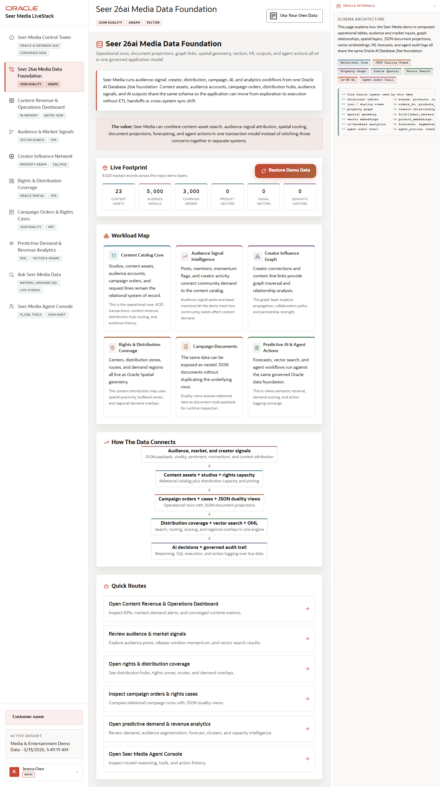

# Scene 2 Seer 26ai Media Data Foundation

## Introduction

This scene shows the shared Oracle data foundation behind the LiveStack. The app brings together relational tables, JSON collections, JSON duality views, property graph relationships, spatial geometry, vector embeddings, ML outputs, and agent audit data.

Estimated Time: 10 minutes

### Objectives

In this lab, you will:
- Inspect the media data foundation.
- Review the workload layers and object counts.
- Use the guided links to jump into downstream scenes.

## Task 1: Inspect the foundation

1. Open **Seer 26ai Media Data Foundation** from the left navigation.
2. Review the headline and the data object cards.
3. Open the **How Oracle Powers This** panel if it is collapsed.

Expected result:
- The scene shows that media workflows are not copied into separate silos.
- The Oracle Internals panel connects the UI to relational, JSON, graph, spatial, vector, ML, and agent audit layers.

## Task 2: Restore or load demo data

1. Locate the **Load Demo Data** or **Restore Demo Data** control.
2. Review its current state.
3. If you are running a disposable local stack, click it to reload the bundled Seer Media demo data.

Expected result:
- The button starts the demo-data workflow when the stack permits it.
- The object counts and data foundation remain aligned with the media story.

## Task 3: Jump to dependent scenes

1. Use the scene links such as **Open Content Revenue & Operations Dashboard**, **Open rights & distribution coverage**, and **Inspect campaign orders & rights cases**.
2. Confirm each link opens the named app scene.

Expected result:
- The data foundation acts as the launch point for every operator workflow.
- The user can connect each downstream screen back to its Oracle data layer.

## Task 4: Why this matters?

Customers need to see that the demo is not just a dashboard. This scene proves that content assets, audience signals, creator networks, campaign cases, rights regions, predictions, and agent actions are modeled together so the rest of the app can make decisions without ETL drift.

## Credits & Build Notes
- **Author** - Oracle LiveStack Team
- **Last Updated By/Date** - Oracle LiveStack Team, 2026-05-13
