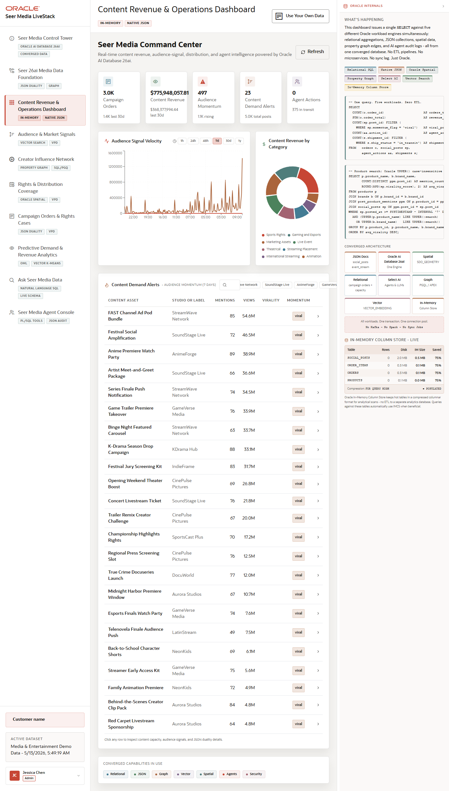

# Scene 3 Content Revenue and Operations Dashboard

## Introduction

This scene is the executive operating dashboard for Seer Media. It combines campaign order volume, content revenue, audience momentum, agent actions, social velocity, trending assets, and converged Oracle runtime evidence.

Estimated Time: 10 minutes

### Objectives

In this lab, you will:
- Review top-level operational KPIs.
- Refresh the dashboard.
- Inspect a trending content asset and its JSON-style detail.

## Task 1: Review the KPI strip

1. Open **Content Revenue & Operations Dashboard**.
2. Review **Campaign Orders**, **Content Revenue**, **Audience Momentum**, and **Agent Actions**.
3. Read the subtitles for recent activity and in-transit work.

Expected result:
- The dashboard summarizes current content operations in one scan.
- The user can distinguish business outcomes from supporting Oracle evidence.

## Task 2: Refresh and inspect trend panels

1. Click the refresh control in the dashboard header.
2. Review **Audience Signal Velocity** and the content revenue chart.
3. Use any visible filter or search control to narrow the trending assets list.

Expected result:
- The visible data refreshes from the backend API.
- Trend panels remain consistent with the current Seer Media dataset.

## Task 3: Open a content asset detail

1. Select a trending content asset or item row.
2. Review the detail tabs and the JSON document view if available.
3. Compare inventory, audience signals, and content metadata for that asset.

Expected result:
- The detail panel connects business context to the underlying data representation.
- The JSON view shows how application-friendly documents can be projected from governed Oracle data.

## Task 4: Why this matters?

The dashboard demonstrates the field value of a converged database: operational metrics, trend detection, content revenue, JSON-style records, and signal context appear in one app without asking the user to reconcile multiple analytics tools.

## Credits & Build Notes
- **Author** - Oracle LiveStack Team
- **Last Updated By/Date** - Oracle LiveStack Team, 2026-05-13
