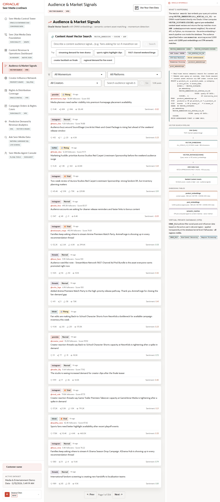

# Scene 4 Audience and Market Signals

## Introduction

This scene shows audience and market signal monitoring with Oracle Vector Search. Users can search content assets semantically, filter signal feeds, and inspect posts that are connected to momentum and content opportunities.

Estimated Time: 10 minutes

### Objectives

In this lab, you will:
- Run semantic content-asset search.
- Filter the audience signal feed.
- Connect vector matches to content opportunity decisions.

## Task 1: Run content asset vector search

1. Open **Audience & Market Signals**.
2. In **Content Asset Vector Search**, enter a phrase such as `fans asking for sci-fi marathon weekend`.
3. Click **Search**.

Expected result:
- The app returns semantically related content assets.
- The results include similarity-driven matches rather than only keyword matches.

## Task 2: Filter audience signals

1. Use the **All Momentum**, **All Platforms**, or **All Creators** filters.
2. Enter a phrase in **Search audience signals by embedding**.
3. Click **Go**.

Expected result:
- The feed narrows to the selected momentum, platform, creator, or semantic-search context.
- The result count and post list update visibly.

## Task 3: Inspect the Oracle evidence

1. Open or review the **How Oracle Powers This** panel.
2. Look for `VECTOR_EMBEDDING`, `VECTOR_DISTANCE(COSINE)`, the ONNX model, and the vector-search pipeline.

Expected result:
- The user can explain that Oracle stores and searches embeddings directly in the database.
- Audience text and content asset descriptions can be matched without copying vectors to a separate search system.

## Task 4: Why this matters?

Media operators need to recognize what fans and communities are signaling before demand turns into missed opportunity. Vector search lets the app translate free-form signal language into ranked content assets that programming, campaign, and distribution teams can act on.

## Credits & Build Notes
- **Author** - Oracle LiveStack Team
- **Last Updated By/Date** - Oracle LiveStack Team, 2026-05-13
