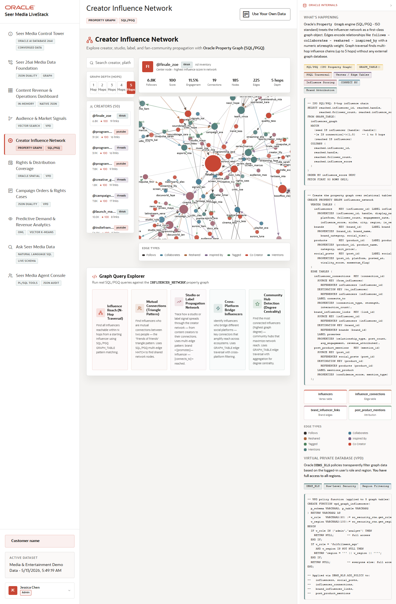

# Scene 5 Creator Influence Network

## Introduction

This scene demonstrates Oracle Property Graph and SQL/PGQ style exploration for media creator relationships. The user can search creators, change network depth, inspect connected nodes, and run example graph queries.

Estimated Time: 10 minutes

### Objectives

In this lab, you will:
- Search and select a creator.
- Explore a graph neighborhood.
- Run a graph query and inspect the SQL evidence.

## Task 1: Select a creator network

1. Open **Creator Influence Network**.
2. Use the search box labeled **Search creator, platform, or niche...**.
3. Select a creator from the creator list.
4. Change the graph depth using the depth controls.

Expected result:
- The graph updates to show the selected creator and connected creators, studios, labels, or audience relationships.
- The selected depth changes the visible neighborhood.

## Task 2: Run a graph query

1. Locate the SQL/PGQ query explorer.
2. Select an example query.
3. Click **Run Query**.
4. Expand **Show SQL** if available.

Expected result:
- The result table shows graph-derived creator or reach information.
- The SQL block shows how Oracle graph queries are grounded in database objects rather than a separate graph store.

## Task 3: Inspect the Oracle internals

1. Open or review **How Oracle Powers This**.
2. Note the property graph badges, vertex and edge tables, influence scoring, and region filtering.

Expected result:
- The user can explain how creator influence is represented as graph relationships and queried with Oracle.

## Task 4: Why this matters?

Media companies make programming, campaign, and creator decisions based on relationship context. A graph scene turns individual signals into network evidence, making it easier to identify who can amplify demand and where audience reach may spread next.

## Credits & Build Notes
- **Author** - Oracle LiveStack Team
- **Last Updated By/Date** - Oracle LiveStack Team, 2026-05-13
