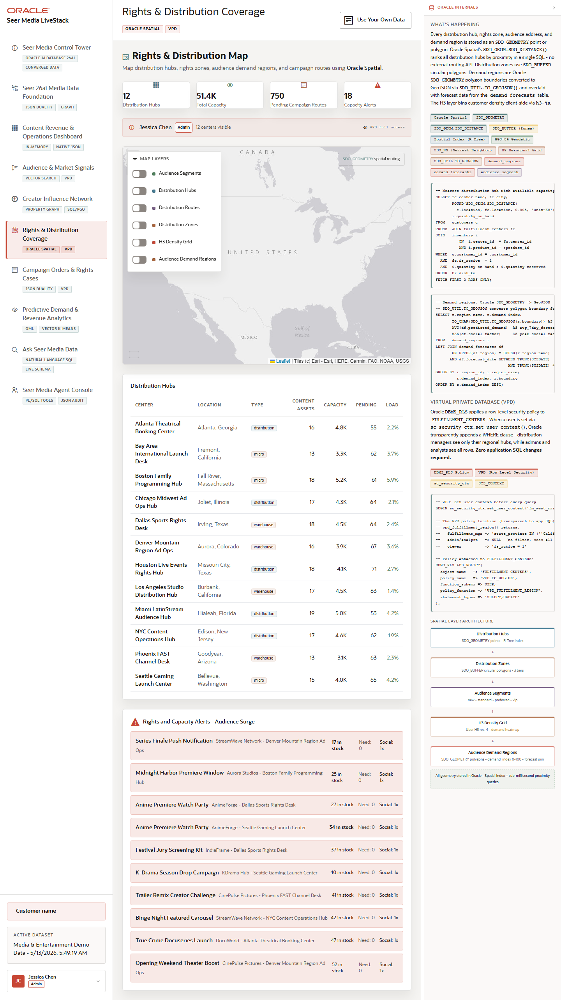

# Scene 6 Rights and Distribution Coverage

## Introduction

This scene maps distribution hubs, rights zones, demand regions, audience points, and campaign routing with Oracle Spatial. It also shows how VPD context can shape what a regional operator sees.

Estimated Time: 10 minutes

### Objectives

In this lab, you will:
- Inspect the spatial map layers.
- Compare rights and demand overlays.
- Review VPD and Oracle Spatial evidence.

## Task 1: Explore map layers

1. Open **Rights & Distribution Coverage**.
2. Review the layer controls and map legend.
3. Toggle visible layers such as distribution hubs, zones, audience demand regions, and campaign routes.

Expected result:
- The map changes as layers are enabled or disabled.
- The scene shows where capacity, rights, and demand overlap geographically.

## Task 2: Review distribution hubs and alerts

1. Inspect the **Distribution Hubs** panel.
2. Review any visible capacity or rights alerts.
3. Compare the selected hub with the map overlays.

Expected result:
- The user can connect map geometry to concrete operating decisions.
- Regional risk becomes visible without leaving the application.

## Task 3: Inspect Oracle Spatial and VPD

1. Open or review **How Oracle Powers This**.
2. Look for `SDO_GEOMETRY`, `SDO_GEOM.SDO_DISTANCE`, `SDO_UTIL.TO_GEOJSON`, spatial indexes, and `DBMS_RLS`.

Expected result:
- The user can explain that spatial geometry, proximity, region filtering, and row-level security are enforced from Oracle data services.

## Task 4: Why this matters?

Rights and distribution decisions are location-sensitive. This scene shows how Seer Media can pair audience demand with rights coverage and hub capacity so operators can prioritize where content should be routed, promoted, or protected.

## Credits & Build Notes
- **Author** - Oracle LiveStack Team
- **Last Updated By/Date** - Oracle LiveStack Team, 2026-05-13
