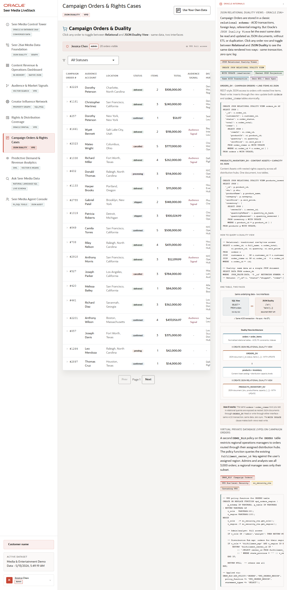

# Scene 7 Campaign Orders and Rights Cases

## Introduction

This scene demonstrates campaign order operations and Oracle JSON Relational Duality. The same campaign can be inspected as relational order data, a JSON document, and a route or rights case.

Estimated Time: 10 minutes

### Objectives

In this lab, you will:
- Review campaign order rows.
- Open an order detail.
- Compare relational, JSON duality, and route views.

## Task 1: Open a campaign order

1. Open **Campaign Orders & Rights Cases**.
2. Use status filters or pagination if needed.
3. Select a campaign order row.

Expected result:
- The order detail opens with the selected campaign context.
- The user sees audience account, order status, line items, revenue, and rights or routing information.

## Task 2: Compare detail tabs

1. In the detail panel, click **Relational**.
2. Click **JSON Duality View**.
3. Click **Campaign Route**.
4. Use **Copy** on the JSON view if you need to share the document shape.

Expected result:
- The same operational case appears through multiple interfaces.
- The JSON document is a projection of governed relational data, not a separate synchronization copy.

## Task 3: Inspect the Oracle evidence

1. Open or review **How Oracle Powers This**.
2. Look for `ORDERS_DV`, `PRODUCTS_INVENTORY_DV`, `CREATE JSON RELATIONAL DUALITY VIEW`, and VPD policy examples.

Expected result:
- The user can explain how Oracle lets application teams work with JSON while preserving relational integrity and access control.

## Task 4: Why this matters?

Media operations often require both transactional correctness and application-friendly JSON. This scene shows how campaign cases can be served to modern apps while still preserving ACID transactions, foreign keys, and policy enforcement in Oracle.

## Credits & Build Notes
- **Author** - Oracle LiveStack Team
- **Last Updated By/Date** - Oracle LiveStack Team, 2026-05-13
