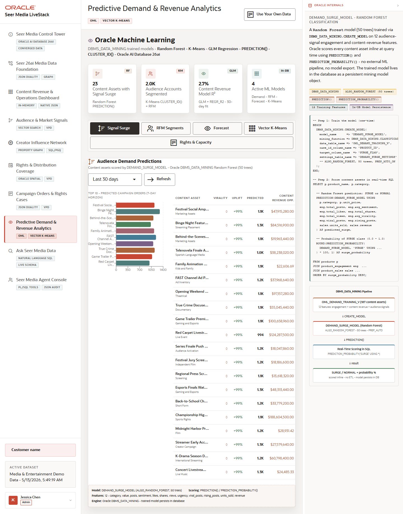

# Scene 8 Predictive Demand and Revenue Analytics

## Introduction

This scene shows Oracle Machine Learning and analytical SQL applied to Seer Media demand, audience segments, content revenue forecasts, vector clusters, and rights-capacity risk.

Estimated Time: 12 minutes

### Objectives

In this lab, you will:
- Review the ML summary cards.
- Move through each analytics tab.
- Refresh selected models and compare outputs.

## Task 1: Review the ML summary

1. Open **Predictive Demand & Revenue Analytics**.
2. Review **Content Assets with Signal Surge**, **Audience Accounts Segmented**, **Content Revenue Model R2**, and **Active ML Models**.

Expected result:
- The scene summarizes demand, segmentation, forecast quality, and model coverage.
- The user sees that the ML story is part of the same operational app.

## Task 2: Walk the analytics tabs

1. Click **Signal Surge** and review predicted campaign orders.
2. Click **RFM Segments** and select a segment filter.
3. Click **Forecast** and change the forecast horizon.
4. Click **Vector K-Means** and choose a cluster count.
5. Click **Rights & Capacity** and review capacity risk.

Expected result:
- Each tab presents a different prediction or segmentation workflow.
- Refresh controls rerun the visible result set against live backend APIs.

## Task 3: Inspect Oracle ML evidence

1. Open or review **How Oracle Powers This**.
2. Look for `DBMS_DATA_MINING`, `PREDICTION()`, `PREDICTION_PROBABILITY()`, `CLUSTER_ID()`, `NTILE(4)`, and vector K-Means evidence.

Expected result:
- The user can explain that models and scoring operate close to the data, reducing data movement and supporting auditable analytical workflows.

## Task 4: Why this matters?

Predictive analytics are most useful when they appear where operators already make decisions. This scene ties demand forecasts, revenue projections, segmentation, clustering, and capacity risk directly to content and campaign operations.

## Credits & Build Notes
- **Author** - Oracle LiveStack Team
- **Last Updated By/Date** - Oracle LiveStack Team, 2026-05-13
