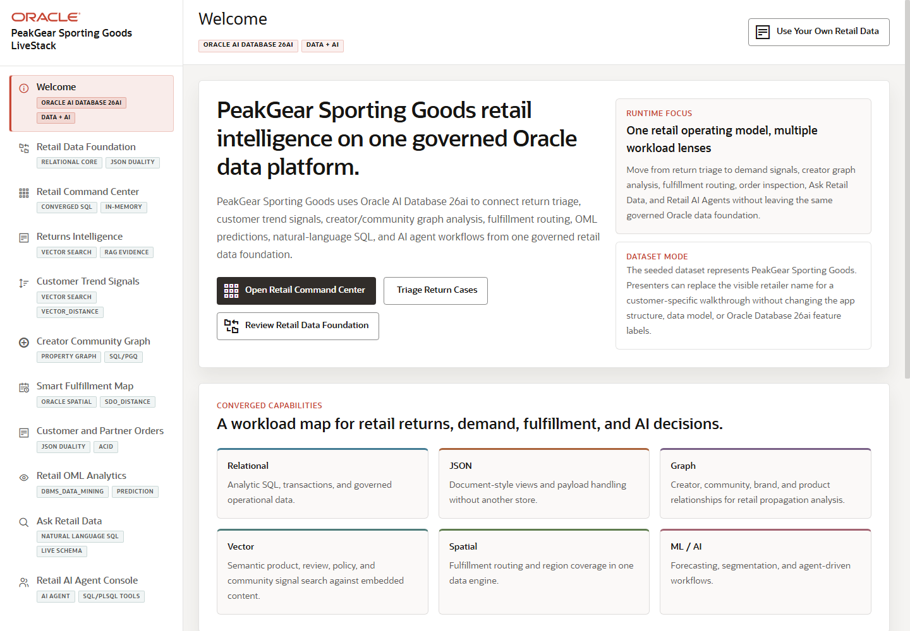

# Seer Sporting Goods Retail LiveStack Guide

## Introduction

Retail teams need to make faster decisions while customer demand, inventory, orders, returns, fulfillment, and customer signals are spread across many systems.
The Seer Sporting Goods LiveStack shows how a retailer can bring those signals together, understand what needs attention, and move from insight to action with more confidence.

This runbook supports the Seer Sporting Goods Retail LiveStack Demo. The demo shows how Oracle AI Database 26ai can help retail teams bring those workloads together on one connected data foundation. Instead of splitting relational transactions, JSON documents, graph relationships, spatial analysis, vector search, machine learning, natural-language SQL, and AI agent workflows across separate systems, the LiveStack shows how those capabilities can work against the same governed Oracle data model.

In the demo, Seer Sporting Goods uses Oracle AI Database to connect inventory, products, orders, service cases, customer signals, creator influence, fulfillment geography, predictive analytics, conversational data access, and agent-assisted operations. The demo follows **AllTerrain Hiking Boots** as the hero product thread: demand builds, customer and creator signals explain why, fulfillment and order views show how the business responds, and analytics, natural-language SQL, and AI agents help teams act from the same governed data foundation.

Estimated Demo Time: 90 minutes

Each scene is designed to take between 5 and 10 minutes.

### Objectives

In this LiveStack demo, you will see how a retailer can use connected data and AI-assisted workflows to identify demand, reduce operational blind spots, improve fulfillment decisions, and make analytics easier to use.

### Prerequisites

Before you begin, confirm that you can open the running Seer Sporting Goods LiveStack in a modern browser. No database or coding knowledge is required to follow the business workflow.

## Demo Flow

- Scene 1: Welcome and Demo Orientation.
- Scene 2: Data Foundation.
- Scene 3: Retail Command Center.
- Scene 4: Customer Trend Signals.
- Scene 5: Creator Influence Network.
- Scene 6: Intelligent Fulfillment Network.
- Scene 7: Unified Order Intelligence.
- Scene 8: Retail OML Analytics.
- Scene 9: Ask Retail Data.
- Scene 10: Retail AI Agent Console.

## Learn More

- [Oracle AI Database 26ai documentation](https://docs.oracle.com/en/database/oracle/oracle-database/26/index.html)
- [Oracle AI Agent Memory](https://www.oracle.com/database/ai-agent-memory/)
- [Oracle AI Vector Search](https://www.oracle.com/database/ai-vector-search/)
- Oracle Spatial and Graph documentation: [Oracle Spatial](https://docs.oracle.com/en/database/oracle/oracle-database/26/spatl/toc.htm) and [Oracle Property Graph](https://docs.oracle.com/en/database/oracle/property-graph/26.2/index.html)
- [Oracle Machine Learning for SQL documentation](https://docs.oracle.com/en/database/oracle/machine-learning/oml4sql/tasks.html)
- [Oracle REST Data Services documentation](https://docs.oracle.com/en/database/oracle/oracle-rest-data-services/25.4/orddg/index.html)
- [Oracle LiveLabs catalog](https://livelabs.oracle.com/)

## Credits & Build Notes
- **Author** - Oracle LiveLabs Team
- **Last Updated By/Date** - Oracle LiveLabs Team, 2026-05-28
