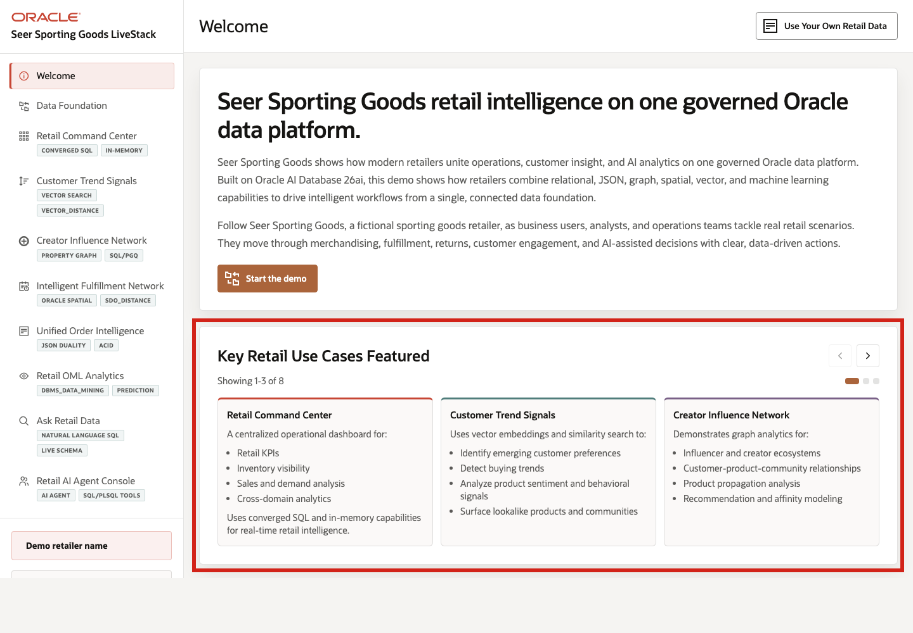

# Scene 1 Welcome and Demo Orientation

## Introduction

This opening scene orients users to the Seer Sporting Goods Retail LiveStack Demo. The welcome page introduces the retail intelligence story and uses a carousel to preview the eight use cases available in the demo.

Estimated Time: 5 minutes

### Objectives

In this scene, you will:
- Review the use case carousel on the welcome page.
- Learn which eight retail use cases are available to explore in the LiveStack Demo.
- Use the carousel controls to move through the use case tiles.
- Click **Start the demo** to continue to the next page.

## Task 1: Review the use case carousel

1. Read the three visible use case tiles.
2. Click the right carousel arrow to move forward.
3. Continue until you have reviewed all eight use cases.
4. Use the left carousel arrow if you want to return to earlier tiles.

## Task 2: Continue the demo

1. Click **Start the demo**.
2. Confirm the demo moves to the next page.

## Credits & Build Notes
- **Author** - Oracle LiveStack Team
- **Last Updated By/Date** - Oracle LiveStack Team, 2026-05-19
