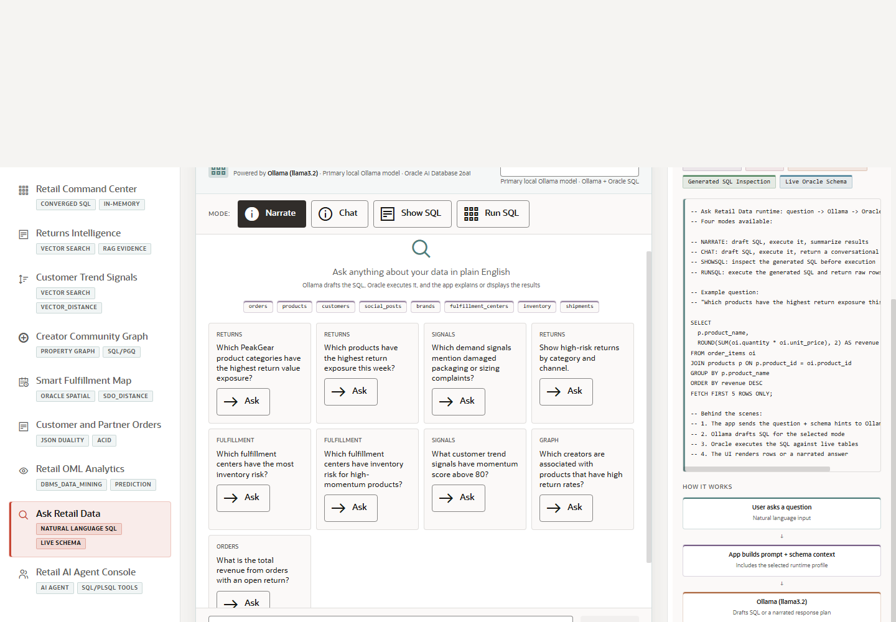

# Scene 10 Ask Retail Data

## Introduction

This scene demonstrates a natural-language data workflow. The user asks a retail question, the app routes it through an AI runtime, and Oracle remains the source of truth for generated SQL, execution, and returned rows.

Estimated Time: 10 minutes

### Objectives

In this lab, you will:
- Open **Ask Retail Data**.
- Choose a question mode such as show SQL or run SQL.
- Ask a natural-language question against the retail schema.

## Task 1: Review the Ask Retail Data workspace

1. Click **Ask Retail Data** in the sidebar.
2. Review the runtime profile and mode controls.
3. Inspect the example questions or prompt buttons.

Expected result:
- The page presents a chat-like data experience with visible SQL governance.
- The presenter can explain that business users can ask questions while the database remains the execution authority.

## Task 2: Ask a retail question

1. Select **Show SQL** to inspect generated SQL before execution, or **Run SQL** to return rows.
2. Enter a question such as `Which products have the highest return risk?`
3. Click **Ask** and review the generated SQL, answer, or result table.

Expected result:
- The app shows a generated SQL path or database-backed answer.
- The audience understands how natural-language interfaces can preserve transparency when SQL is visible.

## Task 3: Why this matters?

Retail users want answers without waiting for a custom report, but governed data teams still need traceability. This scene shows a practical pattern: natural language for the user experience, SQL visibility for trust, and Oracle execution for control.

## Credits & Build Notes
- **Author** - Oracle LiveStack Team
- **Last Updated By/Date** - Oracle LiveStack Team, 2026-05-13
