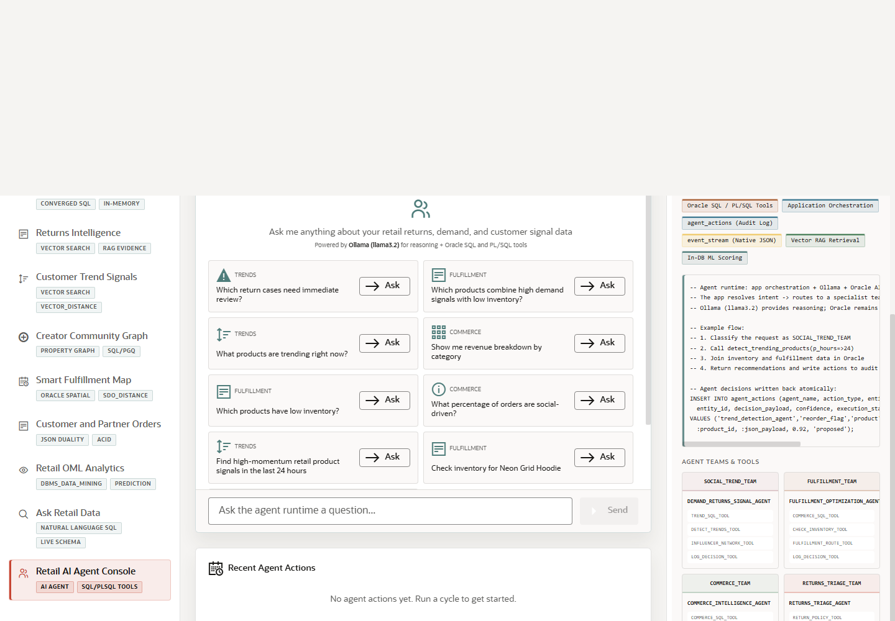

# Scene 11 Retail AI Agent Console

## Introduction

This final app scene demonstrates agent-driven retail operations. The console presents runtime profiles, agent teams, suggested questions, tool history, event stream records, and agent actions so AI assistance can be shown with operational auditability.

Estimated Time: 12 minutes

### Objectives

In this lab, you will:
- Open **Retail AI Agent Console**.
- Ask an agent question or run an agent cycle.
- Review the tool history, event stream, and audit trail.

## Task 1: Review the agent runtime

1. Click **Retail AI Agent Console** in the sidebar.
2. Review the runtime profile selector and agent team descriptions.
3. Inspect the action, event, or tool history panels.

Expected result:
- The page shows agent behavior as an observable operating surface.
- The audience sees that agent actions can be logged and reviewed.

## Task 2: Ask or run an agent workflow

1. Enter a question such as `Which return cases need immediate review?`
2. Click **Ask**, or use the visible control to run a cycle when available.
3. Review the agent response, any table output, and the action history.

Expected result:
- The agent responds with a retail-relevant recommendation or evidence summary.
- The page records the workflow context so the presenter can discuss auditability and operational trust.

## Task 3: Why this matters?

AI agents are more credible in enterprise workflows when their tools, actions, and outputs are visible. This scene shows how a retailer can use AI assistance while still grounding recommendations in Oracle-backed data, SQL or PL/SQL tools, and JSON audit records.

## Credits & Build Notes
- **Author** - Oracle LiveStack Team
- **Last Updated By/Date** - Oracle LiveStack Team, 2026-05-13
