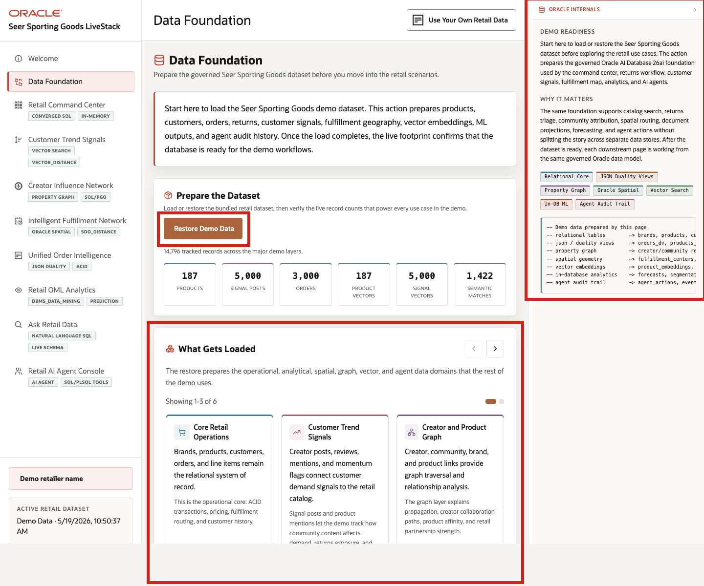

# Scene 2 Data Foundation

## Introduction

This scene prepares the trusted retail dataset used throughout the demo. Loading or restoring the data gives every later screen the same clean starting point, so dashboards, product signals, fulfillment views, predictions, and AI responses all reflect the same version of the business.

Estimated Time: 5 minutes

### Objectives

In this scene, you will learn what retail decision the page supports, what evidence the user should inspect, and what action the business may take next.

## Task 1: Prepare the dataset

The load prepares sporting-goods products, brands, customers, orders, service cases, customer demand signals, fulfillment geography, vector embeddings, graph relationships, machine learning outputs, and agent audit history. These records become the shared foundation for every later scene.

1. Click **Data Foundation** in the sidebar.
2. In **Prepare the Dataset**, click **Load Demo Data**.
3. If the dataset is already loaded, click **Restore Demo Data** to reset the demo data to a clean state.
4. Wait for the progress indicator to finish and review the refreshed record counts.

## Task 2: Review what gets loaded

Review what gets loaded to show that the demo uses recognizable retail data: products, customers, orders, returns, inventory, fulfillment locations, customer signals, predictions, and AI action history.

1. Scroll to **What Gets Loaded**.
2. Read the three visible carousel tiles.
3. Use the right carousel arrow to review the remaining tiles.
4. Look for the major data types used in the demo: relational tables, JSON duality views, graph relationships, spatial geometry, vector embeddings, machine learning results, and agent audit records.
5. Review the **Oracle Internals** sidebar after the business flow is clear. Use it to connect the visible retail outcome to the database capabilities behind the page.

You can move to the next scene.

## Credits & Build Notes
- **Author** - Oracle LiveLabs Team
- **Last Updated By/Date** - Oracle LiveLabs Team, 2026-05-28
