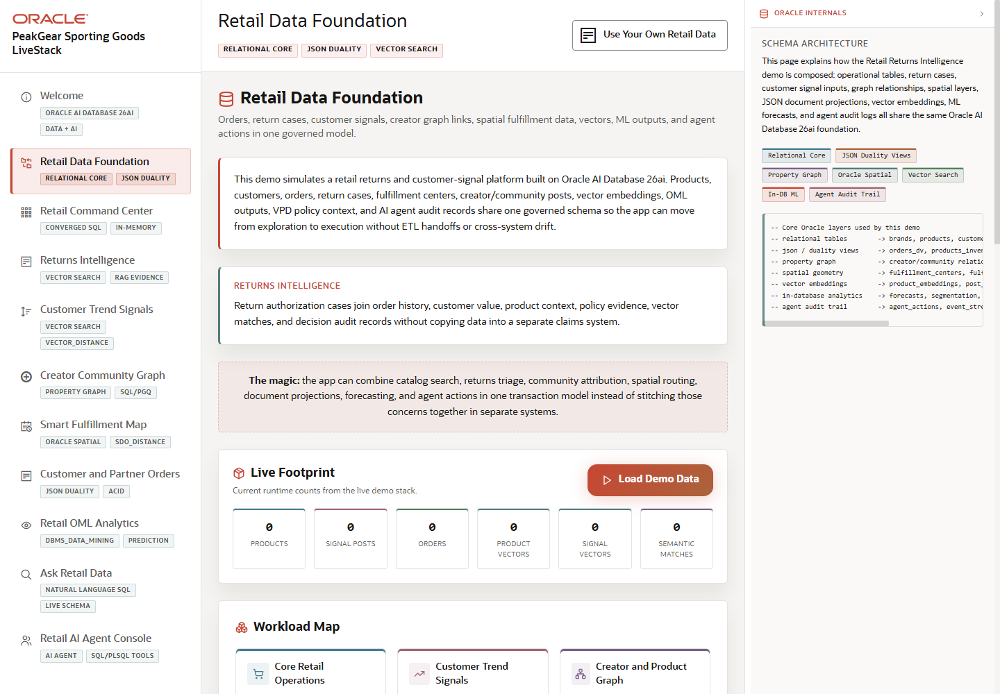

# Scene 2 Retail Data Foundation

## Introduction

This scene explains the data foundation behind the demo. It ties product, order, inventory, customer, returns, creator, social, spatial, and ML-ready data into a single Oracle-backed retail model.

Estimated Time: 8 minutes

### Objectives

In this lab, you will:
- Open **Retail Data Foundation**.
- Inspect how the app presents the Oracle 26ai workload map.
- Connect the model to the scenes that follow.

## Task 1: Open the data model scene

1. Click **Retail Data Foundation** in the sidebar.
2. Review the visible schema and workload sections.
3. Identify which parts of the model support returns, social signals, graph relationships, fulfillment, and orders.

Expected result:
- The data model scene opens with the retail schema story visible.
- The audience can see how the later workflows are grounded in shared operational data.

## Task 2: Explain the Oracle capability map

1. Review the badges and diagrams for relational, JSON, graph, vector, spatial, security, and ML features.
2. Inspect any SQL or schema examples shown in the page.
3. Compare this foundation with a multi-system architecture that would require ETL or duplicated business rules.

Expected result:
- The presenter can explain why the application does not need a separate database for each workload.
- The audience understands why governance and security context matter before moving into operational screens.

## Task 3: Why this matters?

Retail data is often split across commerce, fulfillment, marketing, customer service, and analytics systems. This scene shows the alternative: one governed data foundation that can serve multiple workload-specific experiences without losing the operational context.

## Credits & Build Notes
- **Author** - Oracle LiveStack Team
- **Last Updated By/Date** - Oracle LiveStack Team, 2026-05-13
