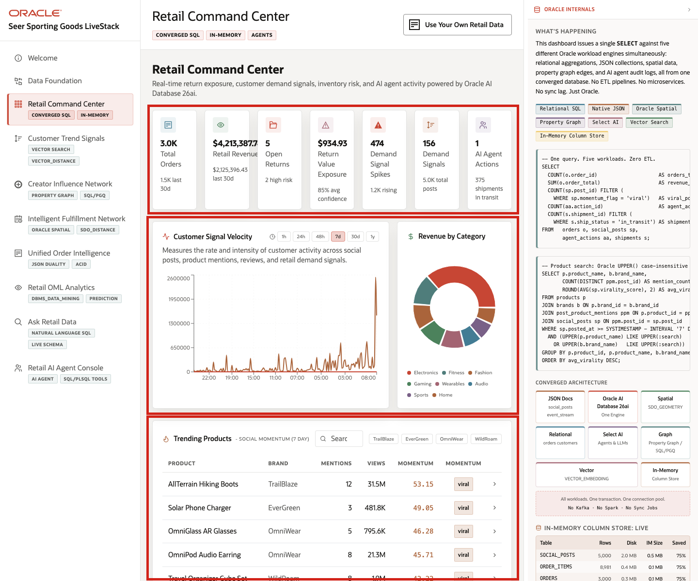
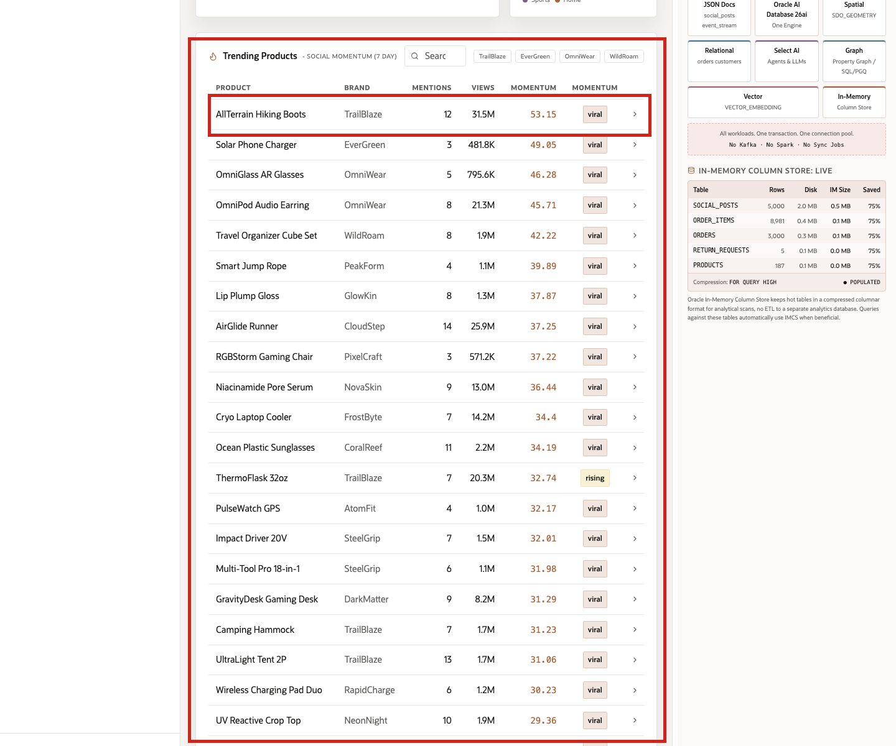
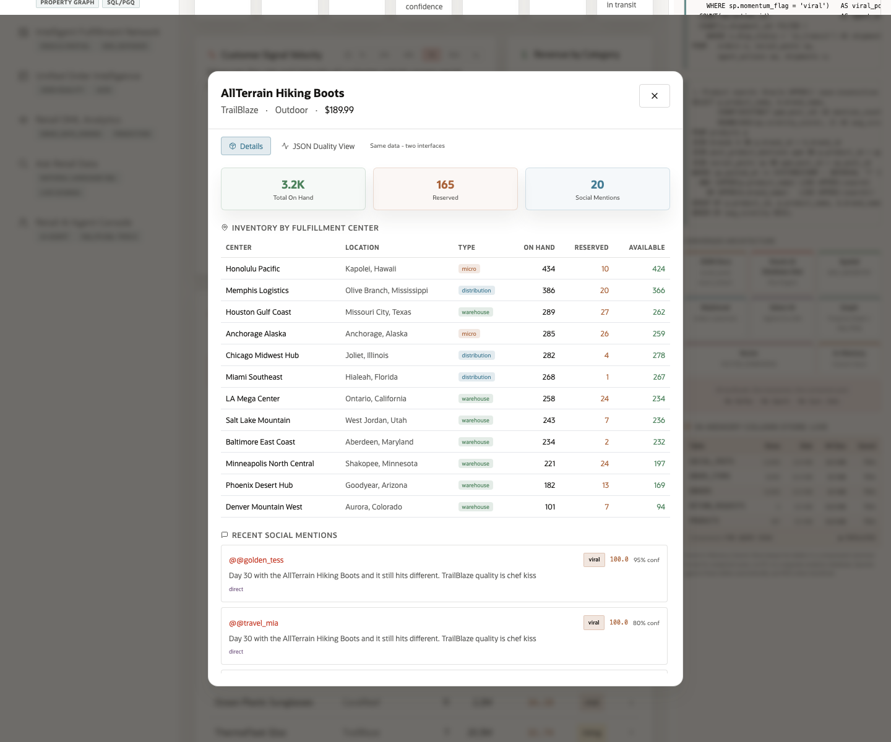
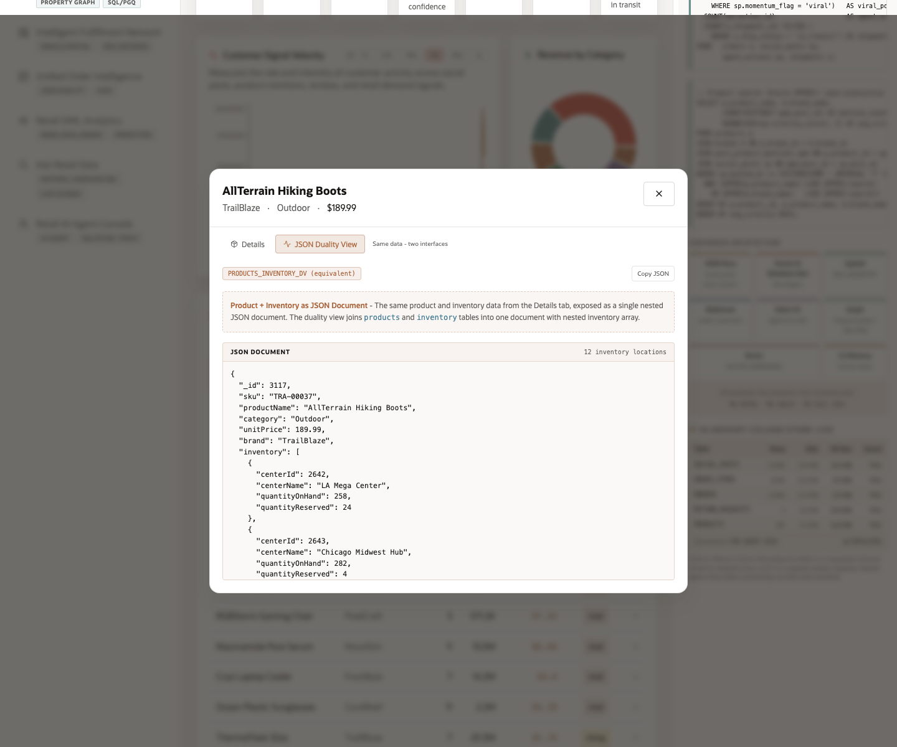

# Scene 3 Retail Command Center

## Introduction

Retail Command Center gives retail operations leaders, merchandising analysts, and digital commerce managers a clear daily view of the business. It tracks revenue, open service cases, service-value exposure, demand spikes, customer momentum, inventory risk, and AI-driven recommendations in one place.

This team must see shifts in customer demand, product availability, and operational risk as they emerge, not after they turn into separate escalations. The dashboard helps leaders spot patterns early, act faster, and keep the business aligned across commerce, service, and fulfillment.

Dashboards like this are difficult to implement when retail data is split across commerce systems, fulfillment platforms, social listening tools, customer service applications, and analytics pipelines. Teams often need copied data, ETL jobs, separate search indexes, and reconciliation logic before a dashboard can show a trustworthy view.

Oracle AI Database helps address that challenge by keeping operational, analytical, JSON, in-memory, and AI-ready data close to the same governed data foundation. In this scene, the dashboard brings together live retail KPIs, customer signal velocity, product trend data, and product-level detail without sending the user to a different application. The AllTerrain Hiking Boots row gives the seller a clear opening example: demand is visible at the dashboard level and then traceable down to inventory, social signals, and JSON application shape.

Estimated Time: 10 minutes

### Objectives

In this scene, you will learn what retail decision the page supports, what evidence the user should inspect, and what action the business may take next.

## Task 1: Review the command center dashboard

Use the dashboard as a triage view. In the current demo dataset, the opening KPI row shows **3,000** total orders, about **$4.2M** in retail revenue, **474** demand signal spikes, **156** demand signals, and the current agent action count. A merchandising user can start with those metrics, then move to the trending products table to see which products are driving the demand story.

1. Click **Retail Command Center** in the sidebar.
2. Review the KPI cards across the top of the page. These summarize the current operating picture: total orders, retail revenue, open service cases, service value exposure, demand signal spikes, demand signals, and AI agent actions.
3. Review **Customer Signal Velocity**. This chart measures the rate and intensity of customer activity across social posts, product mentions, reviews, and retail demand signals.
4. Review **Revenue by Category** to see which categories are contributing most to sales.
5. Review the Oracle Internals sidebar after the business flow is clear. Use it to connect the visible retail outcome to the database capabilities behind the page.

## Task 2: Review trending products

The table helps the user move from dashboard-level signals to product-level evidence. In the current demo dataset, **AllTerrain Hiking Boots** appears as a leading TrailBlaze outdoor product with **12** recent mentions, more than **31M** views, and **viral** peak momentum. That row gives the seller a concrete way to connect the home-page story to live operating data.

1. Scroll to **Trending Products**.
2. Review the product rows. The table ranks products by recent social momentum and shows product name, brand, mentions, views, average momentum score, and momentum label.
3. Use the search field or brand chips if you want to narrow the table.
4. Click the **AllTerrain Hiking Boots** row.

The table helps the user move from dashboard-level signals to product-level evidence. In the current demo dataset, **AllTerrain Hiking Boots** appears as a leading TrailBlaze outdoor product with **12** recent mentions, more than **31M** views, and **viral** peak momentum. That row gives the seller a concrete way to connect the home-page story to live operating data.

## Task 3: Inspect the product detail modal

Open the product detail modal to connect customer momentum with operational readiness. The user can see whether the product has enough available inventory and whether recent signals support further action.

After you click **AllTerrain Hiking Boots**, the detail modal opens. The default **Details** view shows the selected product, TrailBlaze brand, Outdoor category, $189.99 price, total on-hand inventory, reserved inventory, and social mention count.

Review the inventory table to see where the product is stocked, how many units are on hand, how many are reserved, and how many are still available by fulfillment center. Then review the recent social mentions to connect the product's operational status with customer activity and sentiment.

## Task 4: Review the JSON Duality View

1. In the product modal, click **JSON Duality View**.
2. Review the JSON Duality View to show that the same trusted product data can support different users. Business users see product details in the interface, while applications can use the same information as a structured document.

The point of this view is to show that the same data can support different application needs. The **Details** tab presents the data as an operational user interface for business users. The **JSON Duality View** presents the same product and inventory information as a nested JSON document that is useful for APIs and application developers. Oracle JSON Relational Duality lets the application expose document-style access without copying the data into a separate document store.

You can move to the next scene.

## Credits & Build Notes
- **Author** - Oracle LiveLabs Team
- **Last Updated By/Date** - Oracle LiveLabs Team, 2026-05-28
