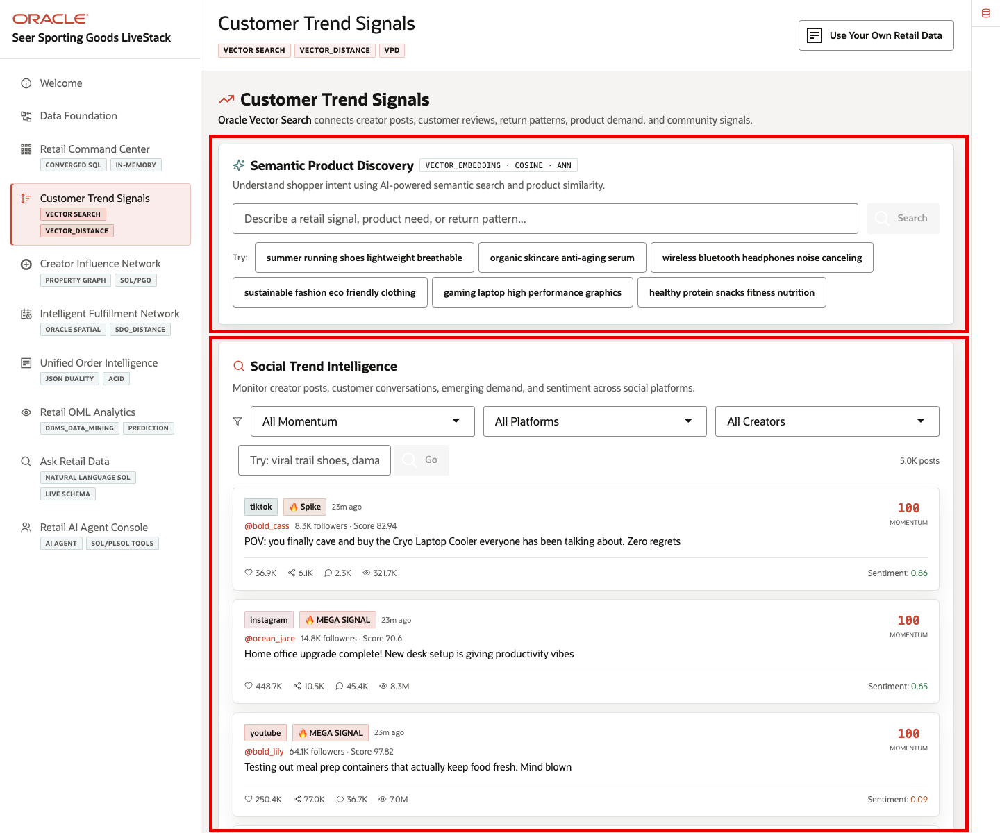
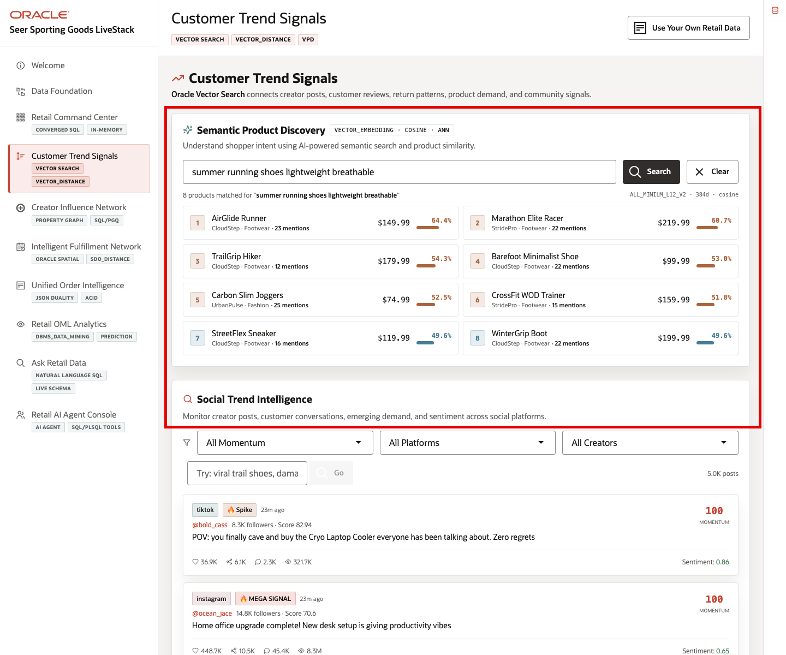
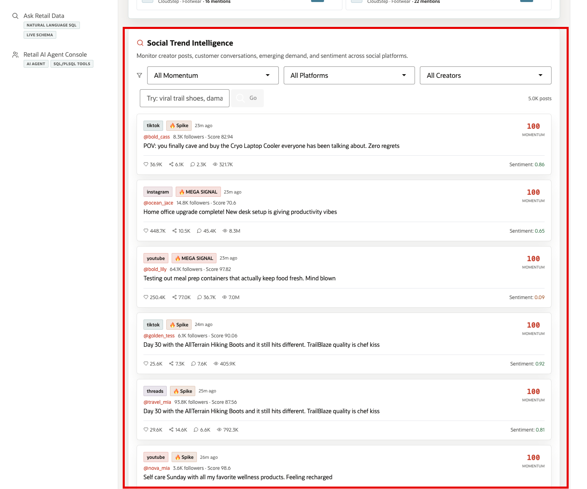
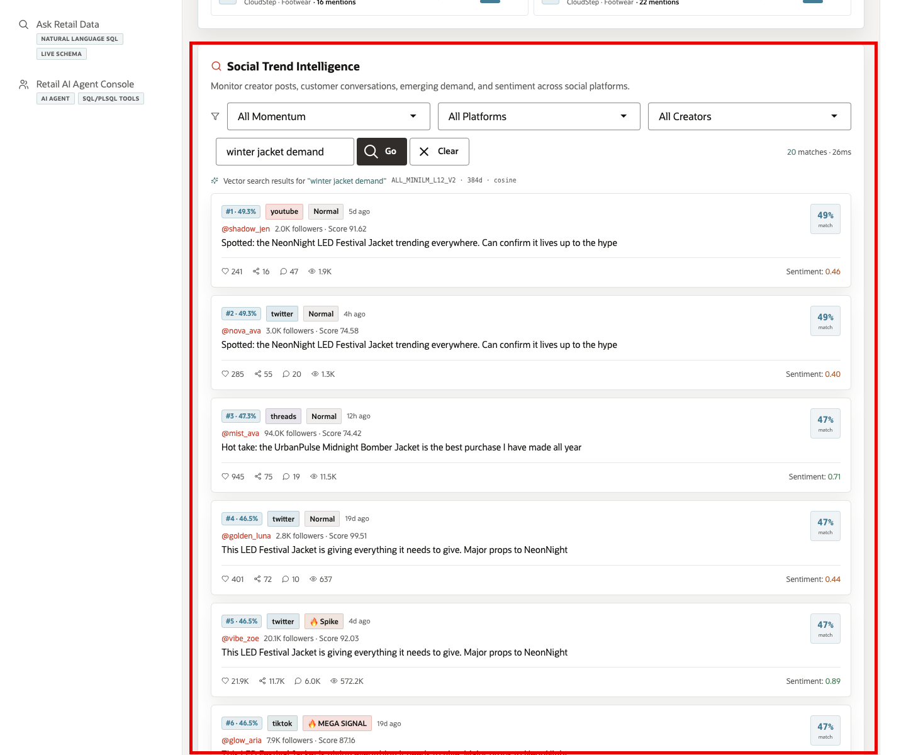

# Scene 4 Customer Trend Signals

## Introduction

**Customer Trend Signals** helps retail teams understand what shoppers are saying before that demand is fully visible in sales reports.By searching products and social content by meaning, the page helps teams spot emerging demand, sentiment changes, product complaints, and creator-driven trends while there is still time to act.

Secure semantic search is difficult to implement when product data, customer conversations, social content, embeddings, search indexes, and security policies live in separate systems. Retail teams often have to move sensitive text into external AI services, synchronize vector indexes, duplicate product catalogs, and then rebuild access control outside the database.

Oracle AI Database helps address these challenges by keeping vector search, SQL, row-level security, and operational retail data together. In this scene, Oracle AI Database can create embeddings inside the database, so sensitive product and customer signal data does not need to be sent to external AI services or exposed through another processing layer.

Oracle Vector Search can embed a business query, compare it against product or post embeddings, and return ranked matches while Oracle security policies continue to govern which data the user can see.

Estimated Time: 10 minutes

### Objectives

In this scene, you will learn what retail decision the page supports, what evidence the user should inspect, and what action the business may take next. Additionally,access controls help ensure users see only the data they are allowed to see, which matters for regional order access, customer data, and governed AI use.

## Task 1: Review the Customer Trend Signals page

Review this page to show how the retailer can search by shopper intent, not only by exact product names or keywords.

1. Click **Customer Trend Signals** in the sidebar.
2. Review **Semantic Product Discovery** at the top of the page. This section searches the product catalog by meaning, not only by exact keywords.
3. Review **Customer Demand Intelligence** below it. This section searches creator posts, customer conversations, emerging demand, and sentiment across social platforms.
4. Explain first that the system ranks results by meaning similarity. Then mention VECTOR_DISTANCE only as the database capability that performs that comparison.
5. Explain that access controls help ensure users see only the data they are allowed to see, which matters for regional order access, customer data, and governed AI use.

These embedded product and post signals let the retailer search by shopper intent instead of relying only on exact product names, tags, or report categories.

## Task 2: Run Semantic Product Discovery

In **Semantic Product Discovery**, run a sample query that sounds like real shopper language.The returned products help the merchandising team turn vague demand into concrete products that may need promotion, inventory attention, or further analysis.

1. In **Semantic Product Discovery**, click one of the demo query buttons, such as **AllTerrain Hiking Boots sizing and trail grip**.
2. Review the returned product matches.

The demo query is embedded at runtime and compared against product embeddings stored in Oracle AI Database. The results show ranked products, brand, category, price, mention count, and similarity percentage. In the current demo dataset, this query returns **AllTerrain Hiking Boots** first, followed by related footwear such as **TrailGrip Hiker** and **WinterGrip Boot**. This gives the seller a clean way to show semantic product discovery around the hero product.

This helps merchandising teams turn vague shopper language into a product list they can act on: promote, replenish, investigate, or compare against current inventory.

## Task 3: Review Customer Demand Intelligence

Review **Customer Demand Intelligence** to see where customer attention is increasing across posts, creators, platforms, engagement, and sentiment.

1. Scroll to **Customer Demand Intelligence**.
2. Review the default feed. Each post shows platform, momentum label, creator handle, follower count, influence score, post text, engagement metrics, and sentiment.
3. Use the momentum, platform, or creator filters if you want to narrow the feed.

This section helps the user monitor where customer attention is building. A high-momentum post can indicate an emerging product story, creator-driven demand, a sentiment shift, or a category trend worth investigating.

## Task 4: Run a Customer Demand Intelligence query

Run a customer demand query to investigate a specific demand theme across posts that may use different wording. This helps the retailer find relevant customer and creator signals faster.

1. In the Customer Demand Intelligence search field, enter a demo query such as **damaged packaging complaints hiking footwear**.
2. Click **Go**.
3. Review the ranked post matches.

The result view changes from the default feed to vector search results for the query. Each result shows a match rank and similarity percentage, platform, momentum label, creator context, post text, engagement metrics, and sentiment. In the current demo dataset, the search returns **AllTerrain**-related customer conversation posts near the top of the ranked list. This shows how Oracle AI Database can search unstructured customer and creator language semantically while still keeping the search tied to governed retail data.

You can move to the next scene.

## Credits & Build Notes
- **Author** - Oracle LiveLabs Team
- **Last Updated By/Date** - Oracle LiveLabs Team, 2026-05-28
