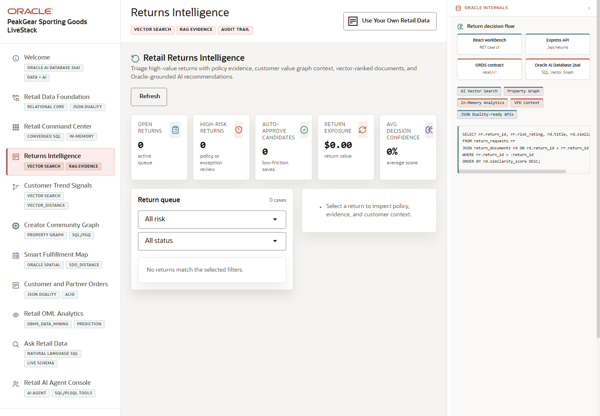

# Scene 4 Returns Intelligence

## Introduction

This scene is the return triage workspace. It combines return queue filters, customer context, policy evidence, vector matches, customer graph context, and decision drafting so a returns team can explain why a case should be approved, denied, escalated, or reviewed.

Estimated Time: 12 minutes

### Objectives

In this lab, you will:
- Open **Returns Intelligence**.
- Select a return case and inspect the evidence.
- Run or review analysis that connects policy, customer, and product context.

## Task 1: Select a return case

1. Click **Returns Intelligence** in the sidebar.
2. Use the risk or status filters to narrow the queue.
3. Select a visible return case from the queue.

Expected result:
- The selected case opens with return details, customer context, and evidence sections.
- The audience sees the return as an explainable workflow rather than a black-box score.

## Task 2: Run the evidence workflow

1. Click **Run Analysis** when the button is available.
2. Review the policy evidence and vector match results.
3. Use **Ask** in the return file panel to ask a question about the selected case.

Expected result:
- The app returns policy or document evidence tied to the case.
- The presenter can explain how vector search and RAG-style evidence help the operator make a defensible decision.

## Task 3: Why this matters?

Returns are expensive when policies, customer history, and product evidence live in separate tools. This scene demonstrates a governed triage pattern where the operator can review evidence, ask questions, and draft a decision from the same application context.

## Credits & Build Notes
- **Author** - Oracle LiveStack Team
- **Last Updated By/Date** - Oracle LiveStack Team, 2026-05-13
