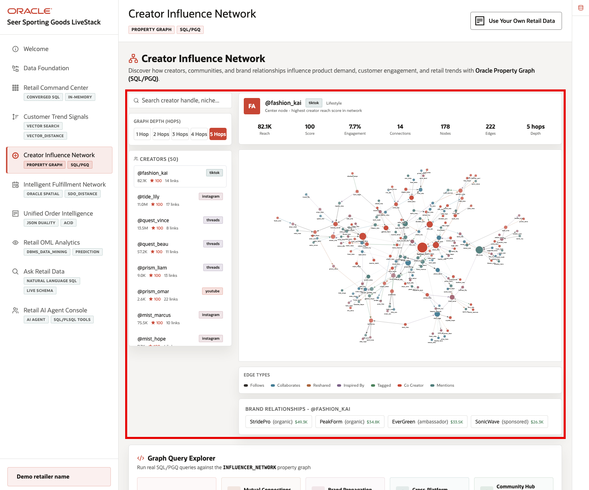
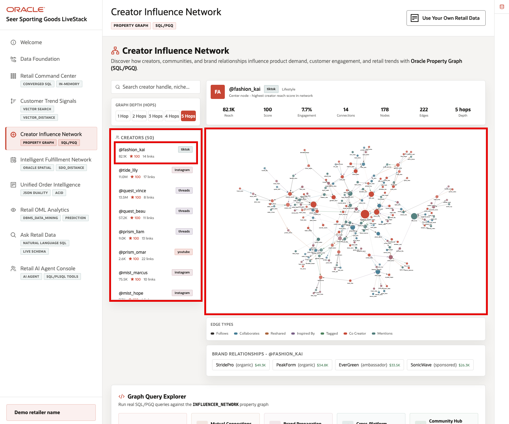

# Scene 5 Creator Influence Network

## Introduction

**Creator Influence Network** helps retail teams look beyond follower count. The page shows how creators, brands, products, posts, and communities are connected, so social commerce teams can identify which creators may actually move demand through the right audience.

Retail teams struggle when this information lives in separate tools. That separation makes it harder to act quickly and trust the result.

Oracle AI Database helps address these challenges by modeling creator, brand, product, and post relationships as a property graph over governed retail data. SQL/PGQ helps answer relationship questions, such as which creators connect communities or how influence can travel through a network.

Estimated Time: 10 minutes

### Objectives

In this scene, you will learn what retail decision the page supports, what evidence the user should inspect, and what action the business may take next.

## Task 1: Review the Creator Influence Network page

Review the network to move beyond a simple creator ranking. The graph helps the retailer see relationships, communities, and possible paths for product influence.

1. Click **Creator Influence Network** in the sidebar.
2. Review the creator list on the left. The list is ordered by influence score and includes follower count, platform, and number of graph links.
3. Review the graph depth control. Increasing the hop count expands the network from direct creator relationships to broader community reach.
4. Review the graph workspace. The graph connects creators through relationship types such as follows, collaborates, reshared, inspired by, tagged, co-creator, and mentions.

The page helps the retailer decide which creators or communities may be worth campaign investment, product seeding, or closer monitoring.

## Task 2: Inspect the selected creator data point

Inspect the selected creator to compare direct performance metrics with network position. This helps the business decide whether the creator can influence the right audience, not just a large audience.

1. Use the selected creator at the top of the list, such as **@fashion_kai**.
2. Review the creator metrics above the graph. For example, the selected creator shows reach, influence score, engagement, connections, nodes, edges, and graph depth.
3. Compare the creator row on the left with the graph on the right. The row tells you the creator's direct business metrics; the graph shows how that creator is connected to the broader community.
4. Click a node in the graph if you want to inspect another connected creator and understand how the network changes.

This is the data point to focus on during the demo: in the current demo dataset, a creator such as **@climb_lily_7** has a **100** influence score, more than **82K** followers, and a multi-hop network that reaches outdoor, training, and sporting-goods communities. Oracle Property Graph makes that relationship context queryable, not just visual.

## Task 3: Run Influence Reach

Run **Influence Reach** to see how far a product or creator message may travel through connected creators. This can support campaign planning and creator selection.

1. Scroll to **Graph Query Explorer**.
2. Select **Influence Reach (N-Hop Traversal)**.
3. Use **@climb_lily_7** as the starting handle and set **Max Hops** to **2**.
4. Click **Run Query**.
5. Review the returned creators.

Focus on the top result. In the current demo dataset, the query returns **25** reachable creators and identifies **@summit_alex_260** as a reachable TikTok creator with an influence score of **100**. This is the point of the graph query: reach is not only about follower count.

It is about which creators can be reached through relationship paths and how influential those reachable creators are.

## Task 4: Run Mutual Connections

Run **Mutual Connections** to find overlap between creators. This can help the retailer identify shared audiences, partnership opportunities, or stronger campaign paths.

1. Click **Back to queries** if you are still viewing the previous query result.
2. Select **Mutual Connections (Triangle Pattern)**.
3. Replace the default handles with **@hydration_jen_223** and **@cycle_aria_170**.
4. Click **Run Query**.
5. Review the mutual connector returned by the graph query.

Focus on **@climb_lily_7**. The query shows **@climb_lily_7** as a mutual connector between the two creators, with **82,123** followers, an influence score of **100**, and relationship paths described as **reshared** and **collaborates**. This helps a retail user identify a bridge creator who could connect two otherwise separate creator paths or communities.

## Task 5: Run Brand Propagation

Run **Brand Propagation** to understand how attention around a brand or product can move through the creator network. This is useful for launches, promotions, and trend monitoring.

1. Click **Back to queries**.
2. Select **Brand Propagation Network**.
3. Use the default brand name **UrbanPulse**.
4. Click **Run Query**.
5. Review the promoter, reached creator, relationship type, connection type, and strength columns.

Focus on the strongest propagation path. In the current demo dataset, **@hike_ella_233** reaches **@fit_tyler_134** through an **organic** relationship and a **reshared** connection with strength **0.992**. This tells the user which creator-to-creator relationship may carry a brand signal most strongly through the network. 

A retail team can use this to plan creator activations, brand launches, or follow-up engagement after a social signal starts to spread.

## Task 6: Run Cross-Platform Bridge Influencers

Run **Cross-Platform Bridge Influencers** to identify creators who connect audiences across platforms. These creators can help a campaign travel beyond one channel.

1. Click **Back to queries**.
2. Select **Cross-Platform Bridge Influencers**.
3. Use the default **Min Platforms Connected** value of **2**.
4. Click **Run Query**.
5. Review the platform reach and total connection counts.

Focus on **@fit_jace_477**. The query identifies this creator as a YouTube-based bridge with an influence score of **100**, reach into **4** platforms, and **8** total cross-platform connections. This result helps show which creators can move demand across platform boundaries rather than staying inside a single social channel.

## Task 7: Run Community Hub Detection

Run **Community Hub Detection** to find creators who sit near the center of an active community. These creators may be useful for product launches, trend monitoring, or deeper partnerships.

1. Click **Back to queries**.
2. Select **Community Hub Detection (Degree Centrality)**.
3. Click **Run Query**.
4. Review the returned rows.

Focus on the top result. In the current demo dataset, the query identifies **@climb_lily_67** as a high-degree community hub with **16** graph connections, **6** edge types, and an average relationship strength of about **0.568**.

This result is useful because it shows a graph-based decision signal: the best community hub is not determined only by follower count, but by how many meaningful relationship paths the creator can activate.SQL/PGQ helps answer relationship questions, such as which creators connect communities or how influence can travel through a network.

You can move to the next scene.

## Credits & Build Notes
- **Author** - Oracle LiveLabs Team
- **Last Updated By/Date** - Oracle LiveLabs Team, 2026-05-28
