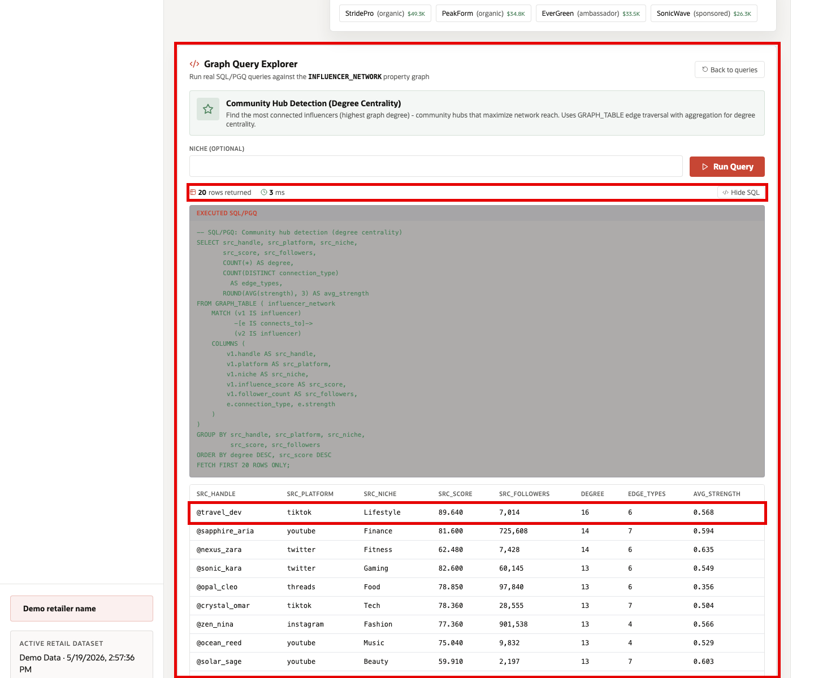

# Scene 5 Creator Influence Network

## Introduction

A social commerce lead, creator partnerships manager, or merchandising strategist uses this page to understand which creators and communities can move product demand. This persona is not only looking for the largest follower count. They need to know how creators connect to one another, which relationships are strong, which communities amplify a brand, and where a product signal may spread next.

This is difficult to implement when creator data, brand relationships, social posts, product mentions, and customer engagement data live in separate tools. Retail teams often end up with flat reports that show isolated creator metrics, but not the multi-hop relationships that explain how attention moves through a network.

Oracle AI Database helps address these challenges by modeling creator, brand, product, and post relationships as a property graph over governed retail data. SQL/PGQ graph queries can traverse relationship paths, calculate reach, identify community hubs, and expose influence patterns without moving the data into a separate graph database. The same database security model can continue to govern which graph records each user can see.

Estimated Time: 15 minutes

### Objectives

In this scene, you will:
- Review the **Creator Influence Network** page and the selected creator network.
- Inspect a specific creator data point, including reach, influence score, connections, graph nodes, graph edges, and depth.
- Use the **Graph Query Explorer** to run SQL/PGQ queries for influence reach, mutual connections, brand propagation, cross-platform bridge creators, and community hubs.
- Interpret how graph results help a retailer find high-value creators, relationships, and communities beyond simple follower counts.

## Task 1: Review the Creator Influence Network page

1. Click **Creator Influence Network** in the sidebar.
2. Review the creator list on the left. The list is ordered by influence score and includes follower count, platform, and number of graph links.
3. Review the graph depth control. Increasing the hop count expands the network from direct creator relationships to broader community reach.
4. Review the graph workspace. The graph connects creators through relationship types such as follows, collaborates, reshared, inspired by, tagged, co-creator, and mentions.

The page helps a retail user move from a flat creator list to a relationship view. That matters because a creator with the highest follower count is not always the best path for spreading a product signal through a community.

## Task 2: Inspect the selected creator data point

1. Use the selected creator at the top of the list, such as **@fashion_kai**.
2. Review the creator metrics above the graph. For example, the selected creator shows reach, influence score, engagement, connections, nodes, edges, and graph depth.
3. Compare the creator row on the left with the graph on the right. The row tells you the creator's direct business metrics; the graph shows how that creator is connected to the broader community.
4. Click a node in the graph if you want to inspect another connected creator and understand how the network changes.

This is the data point to focus on during the demo: a creator may have a strong influence score and a meaningful number of links, but the value comes from how those links connect to other creators, platforms, brands, and communities. Oracle Property Graph makes that relationship context queryable, not just visual.

## Task 3: Run Influence Reach

1. Scroll to **Graph Query Explorer**.
2. Select **Influence Reach (N-Hop Traversal)**.
3. Use the default starting handle **@crystal_cleo** and set **Max Hops** to **2**.
4. Click **Run Query**.
5. Review the returned creators.

Focus on the top result. In the current demo dataset, the query returns **16** reachable creators and identifies **@onyx_ava** as the top reachable creator with an influence score of **100** on TikTok. Also notice that **@jade_nina** has more than **4.2M** followers but a lower influence score. This is the point of the graph query: reach is not only about follower count. It is about which creators can be reached through relationship paths and how influential those reachable creators are.

## Task 4: Run Mutual Connections

1. Click **Back to queries** if you are still viewing the previous query result.
2. Select **Mutual Connections (Triangle Pattern)**.
3. Replace the default handles with **@travel_vince** and **@drift_tess**.
4. Click **Run Query**.
5. Review the mutual connector returned by the graph query.

Focus on **@glow_maya**. The query shows **@glow_maya** as a mutual connector between the two creators, with **875,656** followers, a mutual score of **88.48**, and relationship paths described as **reshared** and **duet**. This helps a retail user identify a bridge creator who could connect two otherwise separate creator paths or communities.

## Task 5: Run Brand Propagation

1. Click **Back to queries**.
2. Select **Brand Propagation Network**.
3. Use the default brand name **UrbanPulse**.
4. Click **Run Query**.
5. Review the promoter, reached creator, relationship type, connection type, and strength columns.

Focus on the strongest propagation path. In the current demo dataset, **@frost_ivy** reaches **@bold_lily** through an **organic** relationship and a **reshared** connection with strength **0.992**. This tells the user which creator-to-creator relationship may carry a brand signal most strongly through the network. A retail team can use this to plan creator activations, brand launches, or follow-up engagement after a social signal starts to spread.

## Task 6: Run Cross-Platform Bridge Influencers

1. Click **Back to queries**.
2. Select **Cross-Platform Bridge Influencers**.
3. Use the default **Min Platforms Connected** value of **2**.
4. Click **Run Query**.
5. Review the platform reach and total connection counts.

Focus on **@prism_omar**. The query identifies this creator as a YouTube-based bridge with an influence score of **100**, reach into **4** platforms, and **8** total cross-platform connections. This result helps show which creators can move demand across platform boundaries rather than staying inside a single social channel.

## Task 7: Run Community Hub Detection

1. Click **Back to queries**.
2. Select **Community Hub Detection (Degree Centrality)**.
3. Click **Run Query**.
4. Review the returned rows.

Focus on the top result. In the current demo dataset, the query identifies **@travel_dev** as a high-degree community hub with **16** graph connections, **6** edge types, and an average relationship strength of about **0.568**. This result is useful because it shows a graph-based decision signal: the best community hub is not determined only by follower count, but by how many meaningful relationship paths the creator can activate.

The query runs against the `INFLUENCER_NETWORK` property graph using SQL/PGQ-style traversal and aggregation. A retailer can use the same approach to identify creators for launches, detect cross-community amplification paths, or understand where a brand message is likely to spread.

You can move to the next scene.

## Credits & Build Notes
- **Author** - Oracle LiveStack Team
- **Last Updated By/Date** - Oracle LiveStack Team, 2026-05-19
