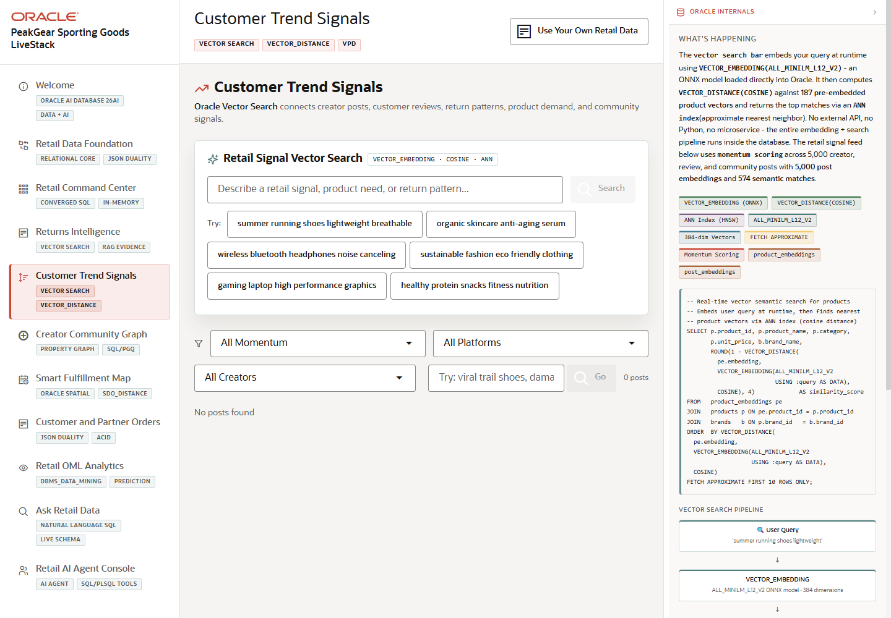

# Scene 5 Customer Trend Signals

## Introduction

This scene shows how social, review, and community content becomes a searchable retail signal. The page uses Oracle Vector Search concepts to connect customer language, creator posts, product mentions, momentum scoring, and demand indicators.

Estimated Time: 10 minutes

### Objectives

In this lab, you will:
- Open **Customer Trend Signals**.
- Run semantic search against product or social content.
- Review momentum and platform filters.

## Task 1: Open the trend signal feed

1. Click **Customer Trend Signals** in the sidebar.
2. Review the vector search panel and feed filters.
3. Inspect the feature badges for embeddings, vector distance, ANN index, and momentum scoring.

Expected result:
- The page presents customer signal analysis as a searchable retail workflow.
- The audience can connect unstructured customer language to product and demand decisions.

## Task 2: Search for a trend

1. Type a phrase such as `lightweight running shoes` into the vector search field.
2. Click **Search** or use one of the suggested query buttons.
3. Review the matching products, posts, or signal results.

Expected result:
- The page shows semantically related retail content.
- The presenter can explain that vector search finds meaning, not only exact keyword matches.

## Task 3: Why this matters?

Retailers need to detect demand before it appears as a clean sales report. This scene turns social and customer language into a measurable signal that merchandising, supply chain, and returns teams can use earlier in the decision cycle.

## Credits & Build Notes
- **Author** - Oracle LiveStack Team
- **Last Updated By/Date** - Oracle LiveStack Team, 2026-05-13
