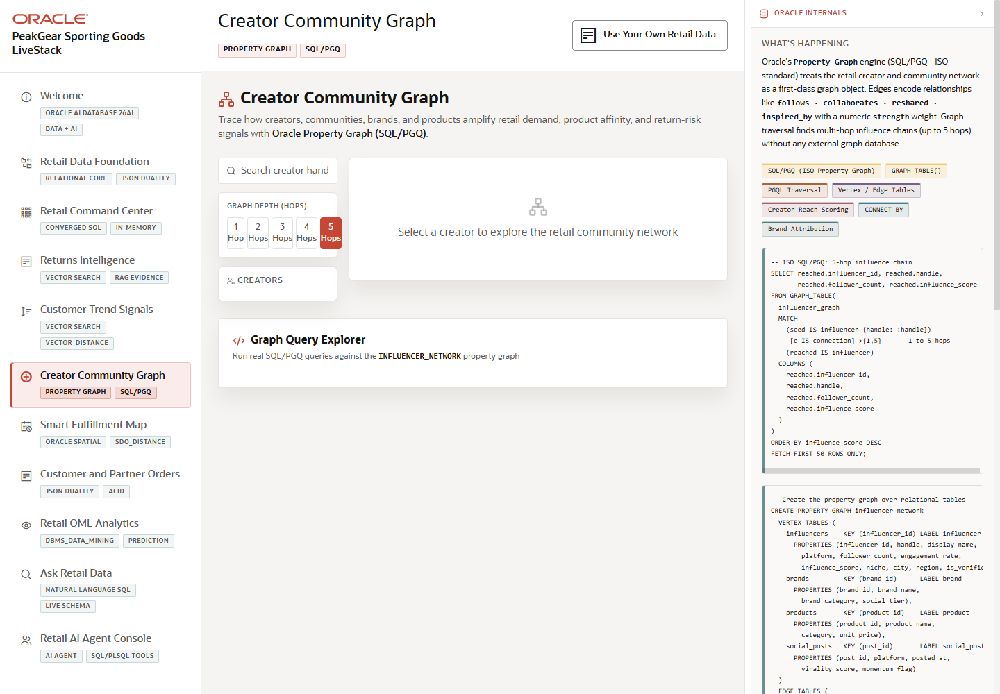

# Scene 6 Creator Community Graph

## Introduction

This scene demonstrates graph analysis for retail influence and propagation. It shows how creator, brand, community, and product relationships can be explored visually and with SQL/PGQ-style query patterns.

Estimated Time: 10 minutes

### Objectives

In this lab, you will:
- Open **Creator Community Graph**.
- Select a creator or graph depth.
- Run a graph query and interpret the propagation signal.

## Task 1: Explore the network

1. Click **Creator Community Graph** in the sidebar.
2. Search for a creator handle or select a visible creator.
3. Change the graph depth when the control is available.

Expected result:
- The graph view updates to show connected creators, brands, communities, or product signals.
- The presenter can explain how relationships affect retail reach and demand movement.

## Task 2: Run a graph query

1. Review the SQL/PGQ query explorer section.
2. Select a predefined query.
3. Click **Run Query** and inspect the result table or graph output.

Expected result:
- The app executes a graph-oriented question against the retail relationship model.
- The audience sees graph as an operational query capability, not a separate visualization-only tool.

## Task 3: Why this matters?

Creator influence is not just a marketing vanity metric. Graph analysis helps a retailer understand how product signals propagate through communities, which creators accelerate demand, and where brand or return signals may spread next.

## Credits & Build Notes
- **Author** - Oracle LiveStack Team
- **Last Updated By/Date** - Oracle LiveStack Team, 2026-05-13
