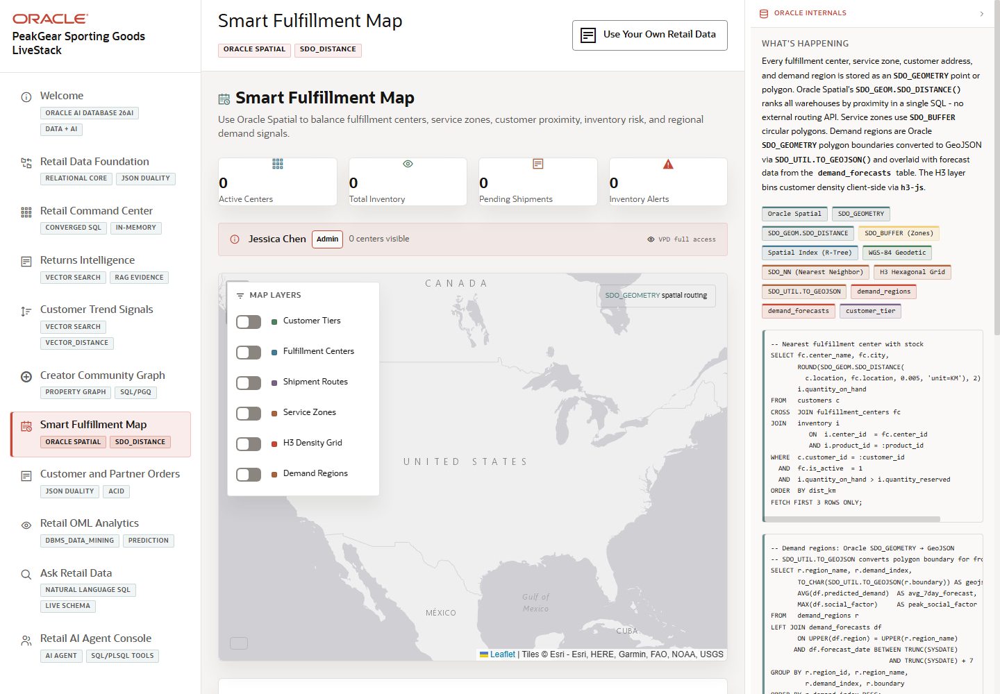

# Scene 7 Smart Fulfillment Map

## Introduction

This scene shows spatial fulfillment intelligence. It combines fulfillment centers, customer locations, demand regions, inventory alerts, and route or distance calculations so supply chain teams can make location-aware decisions.

Estimated Time: 10 minutes

### Objectives

In this lab, you will:
- Open **Smart Fulfillment Map**.
- Review the fulfillment center and demand overlays.
- Use customer, product, or routing controls to inspect a spatial decision.

## Task 1: Open the fulfillment map

1. Click **Smart Fulfillment Map** in the sidebar.
2. Review the map, fulfillment centers, inventory alerts, and demand regions.
3. Inspect the Oracle Spatial badges and SQL evidence.

Expected result:
- The map loads as the primary visual workspace.
- The audience sees fulfillment as a spatial decision tied to inventory and demand.

## Task 2: Inspect a route or nearest-center decision

1. Select a customer and product when the controls are available.
2. Review the nearest fulfillment center, distance, cost, or route summary.
3. Compare the recommendation with inventory and demand pressure shown on screen.

Expected result:
- The page explains why a fulfillment option is selected.
- The presenter can connect `SDO_DISTANCE`, nearest-neighbor logic, and regional overlays to an operational shipping decision.

## Task 3: Why this matters?

Retail fulfillment is expensive when routing, customer geography, and inventory availability are handled in separate systems. This scene shows how spatial data can sit next to operational and demand data so teams can choose a better fulfillment action.

## Credits & Build Notes
- **Author** - Oracle LiveStack Team
- **Last Updated By/Date** - Oracle LiveStack Team, 2026-05-13
