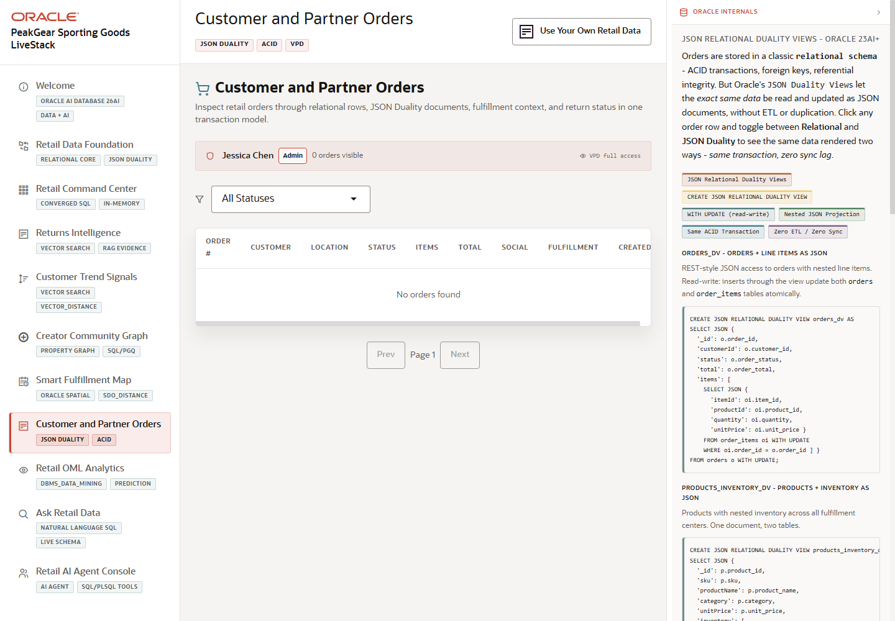

# Scene 7 Unified Order Intelligence

## Introduction

This scene demonstrates operational order data through relational tables, JSON relational duality views, shipment context, and VPD-style security. It is the commerce system-of-record view that connects customer orders to fulfillment and inventory decisions.

Estimated Time: 10 minutes

### Objectives

In this lab, you will:
- Open **Unified Order Intelligence**.
- Inspect order rows, order details, and JSON document views.
- Explain how the same data supports relational and document access.

## Task 1: Review the orders workspace

1. Click **Unified Order Intelligence** in the sidebar.
2. Review the order table and visible filters.
3. Select or expand an order row.

Expected result:
- The selected order exposes operational detail without leaving the page.
- The audience sees order state, customer context, line items, and fulfillment information.

## Task 2: Compare relational and JSON views

1. Open the order detail or JSON view when available.
2. Review the SQL or JSON duality evidence shown on screen.
3. Compare the normalized order tables with the JSON document representation.

Expected result:
- The same business entity is visible as relational data and as an application-friendly JSON document.
- The presenter can explain why JSON relational duality reduces duplicate application persistence layers.

## Task 3: Why this matters?

Retail applications often need transactional integrity and document-style API payloads at the same time. This scene shows how a commerce workflow can preserve ACID relational behavior while serving modern JSON-oriented application patterns.

## Credits & Build Notes
- **Author** - Oracle LiveStack Team
- **Last Updated By/Date** - Oracle LiveStack Team, 2026-05-13
