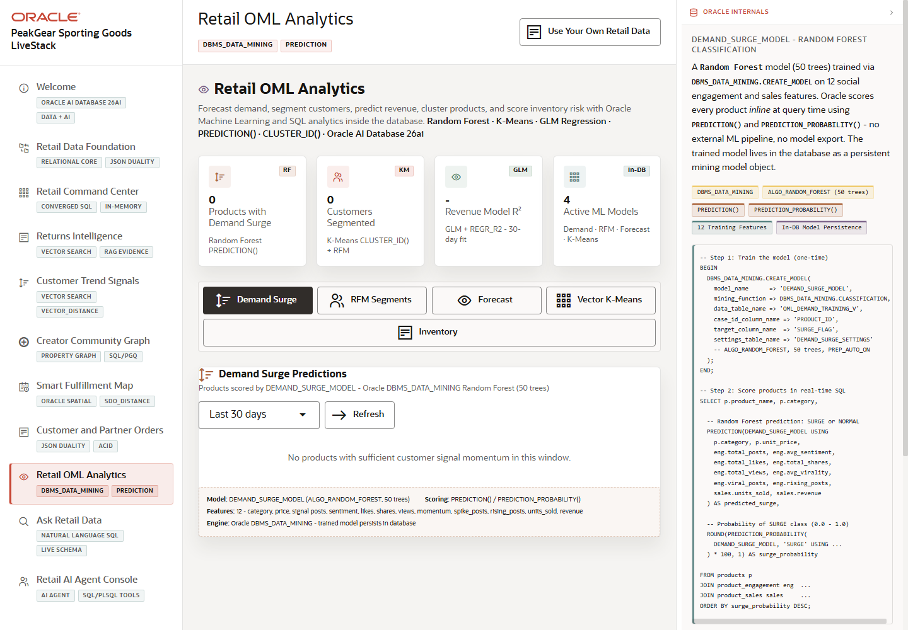

# Scene 9 Retail OML Analytics

## Introduction

This scene presents Oracle Machine Learning analytics inside the retail app. It covers demand forecasting, customer segmentation, revenue forecast, vector clustering, and inventory intelligence so the demo can show predictive workflows without exporting data to a separate analytics system.

Estimated Time: 12 minutes

### Objectives

In this lab, you will:
- Open **Retail OML Analytics**.
- Switch between the analytics modes.
- Review predictions, clusters, and inventory intelligence outputs.

## Task 1: Review the analytics modes

1. Click **Retail OML Analytics** in the sidebar.
2. Review the available tabs or mode buttons.
3. Open demand forecasting, customer segmentation, revenue forecast, vector clustering, and inventory intelligence views as time allows.

Expected result:
- The page shows multiple predictive workflows in one analytics surface.
- The audience sees OML as part of the operational retail application, not a disconnected notebook.

## Task 2: Inspect a prediction or cluster

1. Select a segment, product, forecast horizon, or clustering option when available.
2. Click the relevant action button if the mode requires it.
3. Review the prediction, confidence, cluster assignment, or revenue-at-risk output.

Expected result:
- The page displays a concrete predictive signal.
- The presenter can tie the result back to merchandising, retention, inventory, or demand planning.

## Task 3: Why this matters?

Predictive analytics becomes more useful when it stays close to governed operational data. This scene shows in-database ML patterns that let retailers score, segment, forecast, and explain signals without moving sensitive data through unnecessary pipelines.

## Credits & Build Notes
- **Author** - Oracle LiveStack Team
- **Last Updated By/Date** - Oracle LiveStack Team, 2026-05-13
