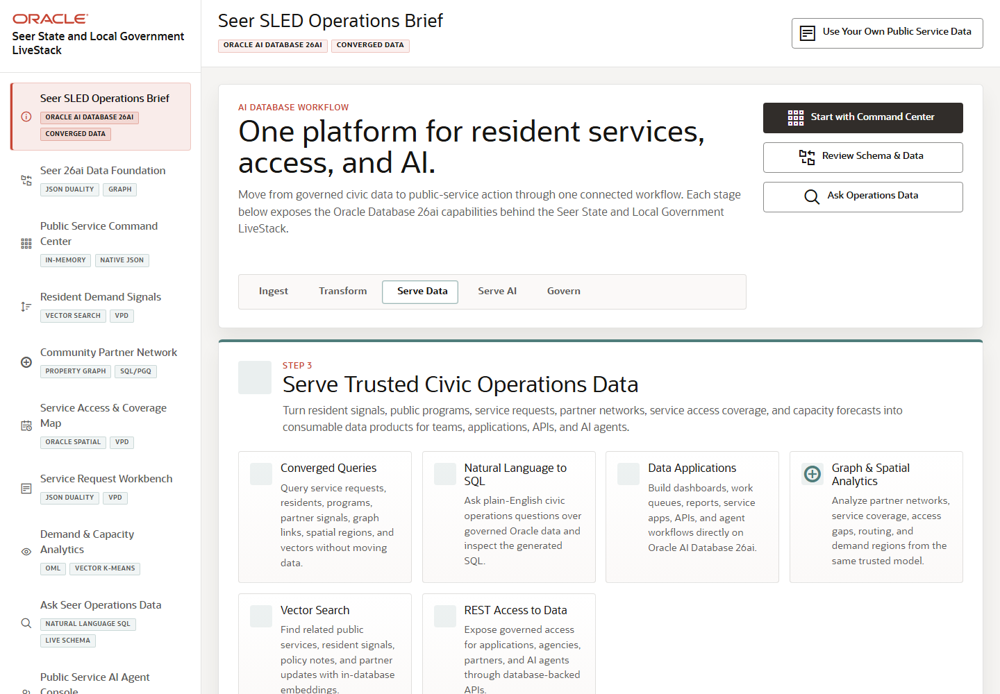

# Scene 1 SLED Operations Brief

## Introduction

This scene orients the demo around one promise: a public-service team can serve trusted civic operations data through dashboards, apps, APIs, analytics, and AI workflows without copying governed data into specialized systems.

Estimated Time: 8 minutes

### Objectives

In this lab, you will:
- Open the SLED operations brief.
- Review the AI Database workflow stages and capability cards.
- Use the quick actions to choose the next operator path.

## Task 1: Open the operations brief

1. Open the SLED LiveStack application.
2. Confirm the sidebar highlights **Seer SLED Operations Brief**.
3. Review the workflow stages: ingest, transform, serve data, serve AI, and govern.

Expected result:
- The home screen shows the SLED value narrative and the active **Serve Data** stage.
- The capability cards explain converged queries, natural-language SQL, data applications, graph and spatial analytics, vector search, and REST access to data.

## Task 2: Use the quick actions

1. Click **Start with Command Center**.
2. Return to the operations brief from the sidebar.
3. Click **Review Schema & Data**.
4. Return again and click **Ask Operations Data**.

Expected result:
- Each button routes to a real application scene.
- The user sees that the brief is not a static landing page; it is the launch point for operational walkthroughs.

## Task 3: Why this matters?

The opening scene gives the SLED audience the frame for the whole demo. The value is not any single chart; it is the ability to use one governed Oracle AI Database foundation across service operations, community demand signals, analytics, APIs, and AI-assisted workflows.

## Credits & Build Notes
- **Author** - Oracle LiveStack Team
- **Last Updated By/Date** - Oracle LiveStack Team, 2026-05-13
- **Screenshot** - Captured from `http://158.178.146.34:8505`.
