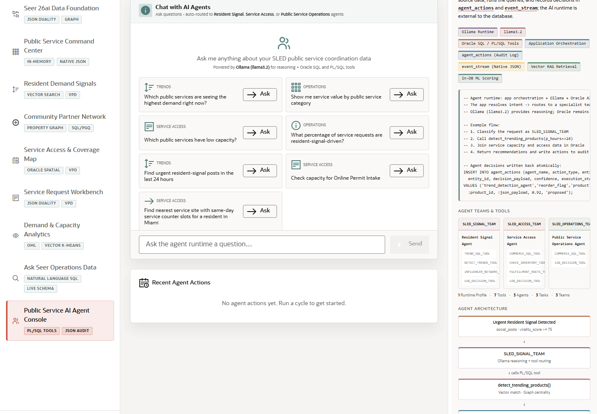

# Scene 10 Public Service AI Agent Console

## Introduction

This scene shows agent-assisted SLED operations. A user can ask questions that route to resident signal, service access, or public service operations agents, while Oracle records tool use and action history.

Estimated Time: 12 minutes

### Objectives

In this lab, you will:
- Review the agent teams and runtime profile.
- Ask an example question.
- Inspect tool badges, response data, and action history.
- Explain why auditability matters for public-sector AI workflows.

## Task 1: Ask an agent question

1. Open **Public Service AI Agent Console**.
2. Review the agent teams: resident signal, service access, and public service operations.
3. Click an example question such as **Which public services have low capacity?**, or type your own question.
4. Click **Ask** or **Send**.

Expected result:
- The console shows the user question and an agent response.
- The response identifies the routed team, timing, tools used, and any returned data or route map.

## Task 2: Inspect action history

1. Review the latest action history or event stream on the page.
2. Look for tool names, status badges, and agent action records.
3. Switch runtime profile if the control is available and explain what changes.

Expected result:
- The scene shows that agent activity is not a hidden black box.
- Oracle-backed action records and JSON event data support review, audit, and operational trust.

## Task 3: Why this matters?

Public-sector AI needs accountability. This scene makes the agent useful without making it untraceable: reasoning, tool routing, SQL-backed retrieval, service access recommendations, and action logging stay visible to the operator.

## Credits & Build Notes
- **Author** - Oracle LiveStack Team
- **Last Updated By/Date** - Oracle LiveStack Team, 2026-05-13
- **Screenshot** - Captured from `http://158.178.146.34:8505/?page=agents`.
