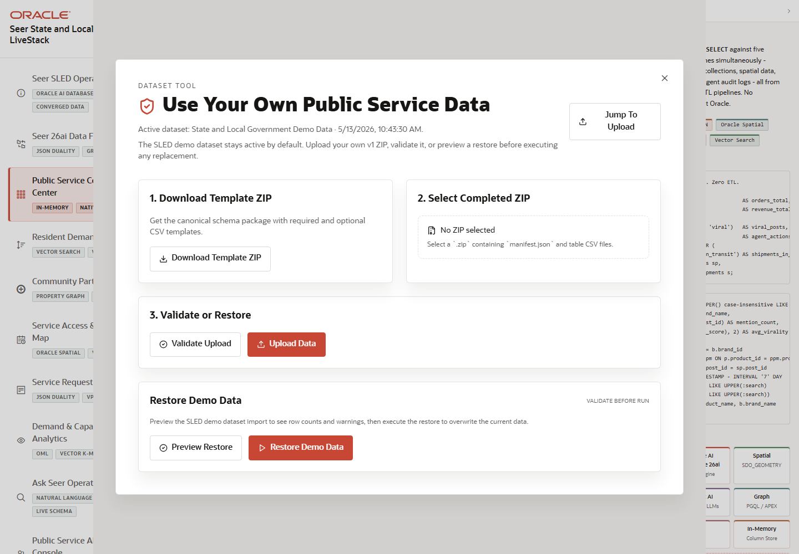

# Scene 11 Use Your Own Public Service Data

## Introduction

This scene covers the top-bar dataset workflow. It lets an operator validate and load a public-service data package, then return the application to the demo data when needed.

Estimated Time: 10 minutes

### Objectives

In this lab, you will:
- Open the dataset manager overlay.
- Review the validation, upload, and restore-demo workflow.
- Explain how custom data changes the active dataset label.

## Task 1: Open the dataset manager

1. From any scene, click **Use Your Own Public Service Data** in the top bar.
2. Review the dataset manager overlay.
3. Confirm that the overlay offers a guided path for loading data or continuing with the current demo dataset.

Expected result:
- A modal opens over the current scene.
- The dataset workflow explains how to validate, upload, import, or restore demo data.

## Task 2: Validate the import workflow

1. Review the available actions, including template download, file selection, validation, upload, and restore demo where visible.
2. If you have a prepared data package, select it and run validation before upload.
3. After any successful dataset change, close the modal and review the **Active dataset** label in the sidebar.

Expected result:
- The application validates data before applying it.
- The active dataset label changes when a custom dataset is loaded and returns to the demo label after restore.

## Task 3: Why this matters?

LiveStacks are strongest when the demo can move from synthetic proof to customer-specific exploration. This workflow gives SLED teams a safer bridge: validate first, load deliberately, and keep the demo restore path available.

## Credits & Build Notes
- **Author** - Oracle LiveStack Team
- **Last Updated By/Date** - Oracle LiveStack Team, 2026-05-13
- **Screenshot** - Captured from `http://158.178.146.34:8505/?page=dashboard` after opening the dataset overlay.
