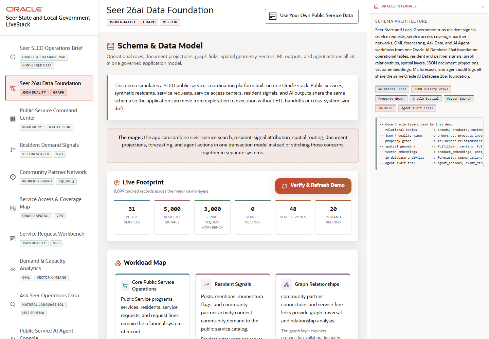

# Scene 2 Seer 26ai Data Foundation

## Introduction

This scene shows the data foundation behind the SLED demo: public services, residents, service requests, resident signals, partner relationships, spatial service access, JSON duality views, vectors, ML outputs, and agent audit trails.

Estimated Time: 10 minutes

### Objectives

In this lab, you will:
- Inspect the public-service data domains.
- Refresh the demo data status.
- Use the quick route cards to connect the model to downstream scenes.

## Task 1: Review the capability groups

1. Open **Seer 26ai Data Foundation** from the sidebar.
2. Review each capability group: core public service operations, resident signals, graph relationships, spatial service access, JSON and duality, and ML, vector, agents.
3. Inspect the data-flow section that connects resident signals, service capacity, requests, spatial, vector, ML, and agents.

Expected result:
- The page presents Oracle AI Database 26ai as one converged operating model instead of separate point solutions.
- The audience can see where each later scene gets its data.

## Task 2: Validate the loaded demo data

1. Click the refresh or status control if it is visible.
2. Review the status cards for public services, resident signals, service requests, vectors, service zones, and demand regions.
3. If counts are zero or missing, run the demo refresh action from this page before continuing.

Expected result:
- The page confirms that the demo data is present.
- The visible counts provide confidence that later scenes are operating against seeded SLED data.

## Task 3: Why this matters?

SLED transformation projects often stall when each workflow needs its own copy of data. This scene shows the opposite pattern: one governed data model can serve dashboards, service maps, JSON applications, vector retrieval, graph analysis, OML scoring, and AI agents.

## Credits & Build Notes
- **Author** - Oracle LiveStack Team
- **Last Updated By/Date** - Oracle LiveStack Team, 2026-05-13
- **Screenshot** - Captured from `http://158.178.146.34:8505/?page=datamodel`.
