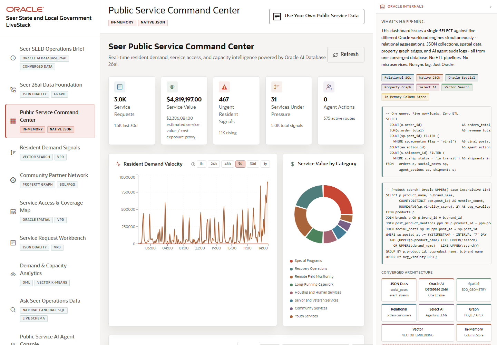

# Scene 3 Public Service Command Center

## Introduction

This scene is the executive operations view. It combines service request volume, estimated service value, urgent resident signals, services under pressure, and agent activity so a leader can decide where to focus.

Estimated Time: 10 minutes

### Objectives

In this lab, you will:
- Review the KPI cards at the top of the command center.
- Inspect converged workload evidence and Oracle feature badges.
- Filter or search services under pressure.
- Open a detail view when a service needs more context.

## Task 1: Review command center KPIs

1. Open **Public Service Command Center**.
2. Review the cards for **Service Requests**, **Service Value**, **Urgent Resident Signals**, **Services Under Pressure**, and **Agent Actions**.
3. Read the Oracle feature badges and the converged workload diagram.

Expected result:
- The command center summarizes current operating pressure in a single screen.
- The Oracle evidence panel connects visible KPIs to relational SQL, native JSON, spatial, graph, vector, Select AI, and in-memory capabilities.

## Task 2: Inspect services under pressure

1. Use the search or filter controls in the services-under-pressure area.
2. Select a service with notable demand or signal momentum.
3. Review the detail or JSON evidence panel if it opens.

Expected result:
- The list narrows to services matching the search or filter.
- Opening a service shows structured detail that explains why it is being surfaced.

## Task 3: Why this matters?

Public agencies need a shared operational picture before they can coordinate response. This scene turns resident signals and service activity into a command-center view that can drive triage, staffing, partner outreach, and service access decisions.

## Credits & Build Notes
- **Author** - Oracle LiveStack Team
- **Last Updated By/Date** - Oracle LiveStack Team, 2026-05-13
- **Screenshot** - Captured from `http://158.178.146.34:8505/?page=dashboard`.
