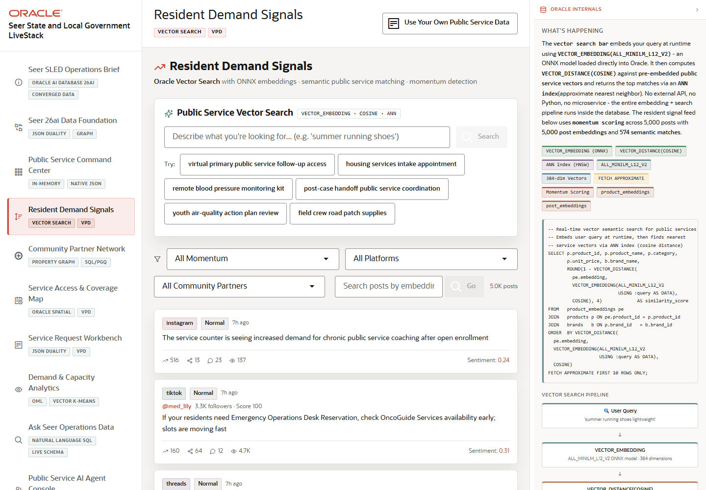

# Scene 4 Resident Demand Signals

## Introduction

This scene shows how the LiveStack detects resident and community demand signals. Operators can search public-service concepts semantically, review urgent posts, and connect signal momentum to the service catalog.

Estimated Time: 10 minutes

### Objectives

In this lab, you will:
- Run a vector search over public service concepts.
- Filter resident signal posts by momentum, platform, or influencer.
- Explain how in-database embeddings support service discovery.

## Task 1: Run public service vector search

1. Open **Resident Demand Signals**.
2. In **Public Service Vector Search**, enter a phrase such as `emergency rental assistance`, `permit intake`, or `food assistance`.
3. Click **Search**.
4. Review the ranked public services and similarity scores.

Expected result:
- The page returns semantically related services, not just exact keyword matches.
- The Oracle evidence panel references `VECTOR_EMBEDDING`, `VECTOR_DISTANCE`, ONNX embeddings, and approximate nearest-neighbor search.

## Task 2: Review community signal momentum

1. Use the resident signal filters for momentum, platform, or influencer.
2. Search posts for a phrase related to a public service need.
3. Review any viral, rising, or urgent signal labels.

Expected result:
- The signal feed narrows to posts that match the selected filters or search terms.
- The user can connect community demand to services that may need attention.

## Task 3: Why this matters?

SLED teams often hear demand through many channels before a formal service request is created. Vector search helps operators connect plain-language resident concerns to the services, programs, and response paths already governed in Oracle AI Database.

## Credits & Build Notes
- **Author** - Oracle LiveStack Team
- **Last Updated By/Date** - Oracle LiveStack Team, 2026-05-13
- **Screenshot** - Captured from `http://158.178.146.34:8505/?page=social`.
