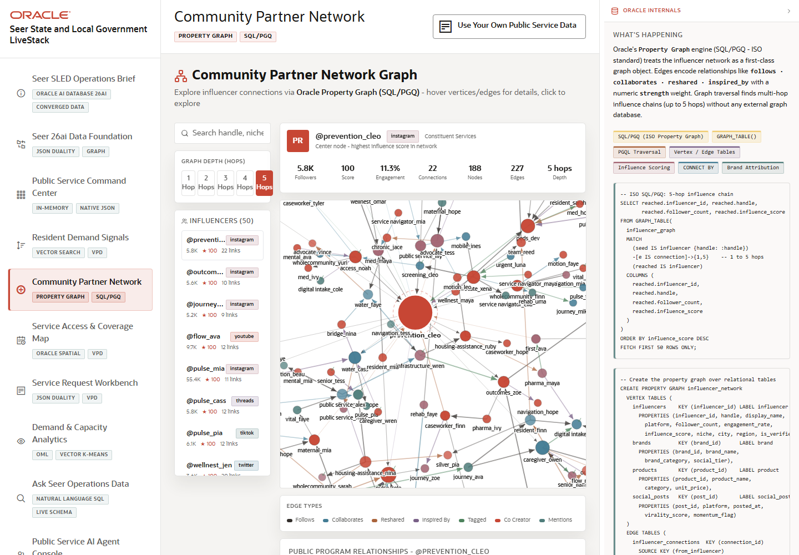

# Scene 5 Community Partner Network

## Introduction

This scene uses graph relationships to show how community partners, services, posts, and influence paths are connected. It helps an operator see who can amplify a response or explain why a service need is spreading.

Estimated Time: 10 minutes

### Objectives

In this lab, you will:
- Explore the partner network.
- Run or review example graph queries.
- Inspect relationship depth and influence paths.

## Task 1: Explore the partner graph

1. Open **Community Partner Network**.
2. Review the graph visualization and the partner list.
3. Select a partner or influencer node.
4. Increase or decrease relationship depth if the control is available.

Expected result:
- The graph updates around the selected partner or relationship depth.
- The operator can identify connected organizations, services, and signal paths.

## Task 2: Run a graph query

1. Open the example query explorer.
2. Select a provided SQL/PGQ or graph query.
3. Click **Run**.
4. Expand the SQL view if you want to show the generated graph statement.

Expected result:
- The query returns relationship evidence from the Oracle property graph.
- The visible SQL or SQL/PGQ reinforces that the graph is backed by database tables and graph metadata.

## Task 3: Why this matters?

Community response is rarely linear. Graph analysis helps a public agency see influence, partnership, and service relationships so it can coordinate outreach through the people and organizations most likely to move the response forward.

## Credits & Build Notes
- **Author** - Oracle LiveStack Team
- **Last Updated By/Date** - Oracle LiveStack Team, 2026-05-13
- **Screenshot** - Captured from `http://158.178.146.34:8505/?page=graph`.
