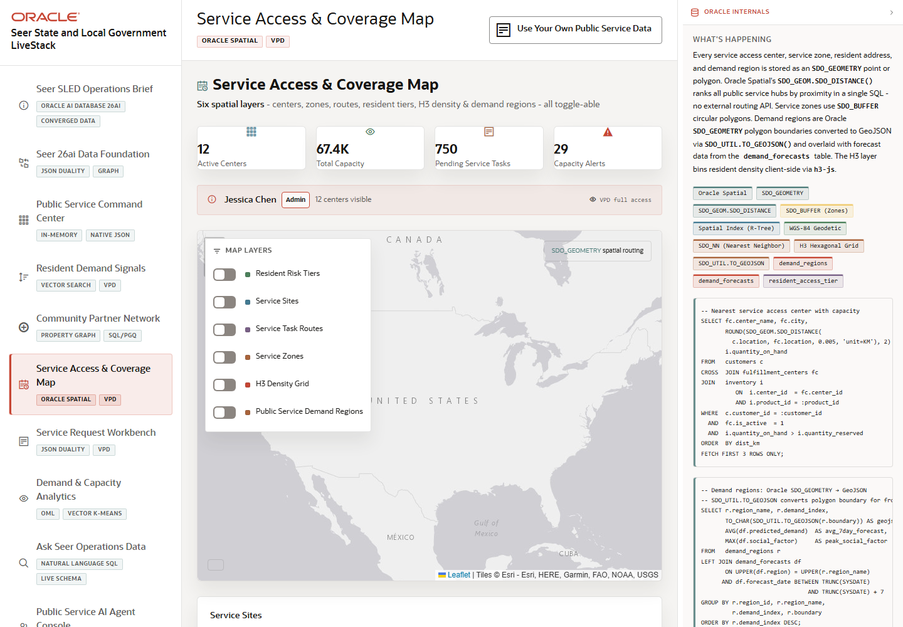

# Scene 6 Service Access and Coverage Map

## Introduction

This scene uses Oracle Spatial to show service sites, service zones, resident access tiers, H3 density, and regional demand overlays. It turns service access into a map-based operating decision.

Estimated Time: 10 minutes

### Objectives

In this lab, you will:
- Review the spatial map and layer controls.
- Toggle coverage, demand, and service site layers.
- Explain how spatial indexing and geometry support service access decisions.

## Task 1: Inspect the service access map

1. Open **Service Access & Coverage Map**.
2. Review the map, service site markers, zones, and demand overlays.
3. Use the layer panel to turn individual layers on or off.

Expected result:
- The map changes as layers are toggled.
- Operators can distinguish service sites, service zones, resident risk tiers, and demand regions.

## Task 2: Compare capacity and access signals

1. Review any alerts or capacity cards next to the map.
2. Select a demand region or service site if the map exposes details.
3. Compare the spatial context with service pressure from the command center.

Expected result:
- The user can see whether a demand signal is near adequate service access or a constrained area.
- The evidence panel shows Oracle Spatial concepts such as `SDO_GEOMETRY`, spatial indexes, distance calculations, buffered zones, and GeoJSON output.

## Task 3: Why this matters?

For SLED teams, geography changes the decision. A high-demand service may need a different response depending on nearby service capacity, partner coverage, travel distance, or neighborhood access tier. Oracle Spatial lets those signals stay close to the operational data.

## Credits & Build Notes
- **Author** - Oracle LiveStack Team
- **Last Updated By/Date** - Oracle LiveStack Team, 2026-05-13
- **Screenshot** - Captured from `http://158.178.146.34:8505/?page=fulfillment`.
