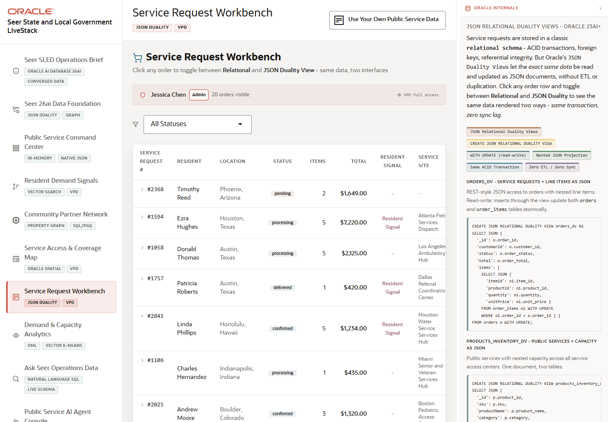

# Scene 7 Service Request Workbench

## Introduction

This scene shows operational service requests as both normalized relational records and JSON duality documents. It is the bridge between service work queues and application-friendly JSON APIs.

Estimated Time: 10 minutes

### Objectives

In this lab, you will:
- Filter service requests by status.
- Open a service request detail panel.
- Compare relational, JSON duality, and service route views.
- Explain how VPD keeps request access governed.

## Task 1: Open a service request

1. Open **Service Request Workbench**.
2. Use the status filter to narrow the list, or leave it on **All Statuses**.
3. Click a service request row to expand the detail panel.

Expected result:
- The row expands into a detail panel.
- The panel shows tabs for **Relational**, **JSON Duality View**, and **Service Task Route**.

## Task 2: Compare the same data in three views

1. Review the **Relational** tab.
2. Click **JSON Duality View** and review the nested document.
3. Click **Service Task Route** and compare the route or spatial task context.
4. Use the copy control on the JSON tab if you want to show the document outside the app.

Expected result:
- The same request can be explained as relational operational data, a JSON document, and a routed service task.
- The Oracle evidence panel connects the scene to JSON relational duality views, ACID consistency, and VPD row-level security.

## Task 3: Why this matters?

Public-service applications often need both transactional integrity and document-style APIs. JSON relational duality lets the SLED team support app developers and operators without duplicating or syncing separate data stores.

## Credits & Build Notes
- **Author** - Oracle LiveStack Team
- **Last Updated By/Date** - Oracle LiveStack Team, 2026-05-13
- **Screenshot** - Captured from `http://158.178.146.34:8505/?page=orders`.
