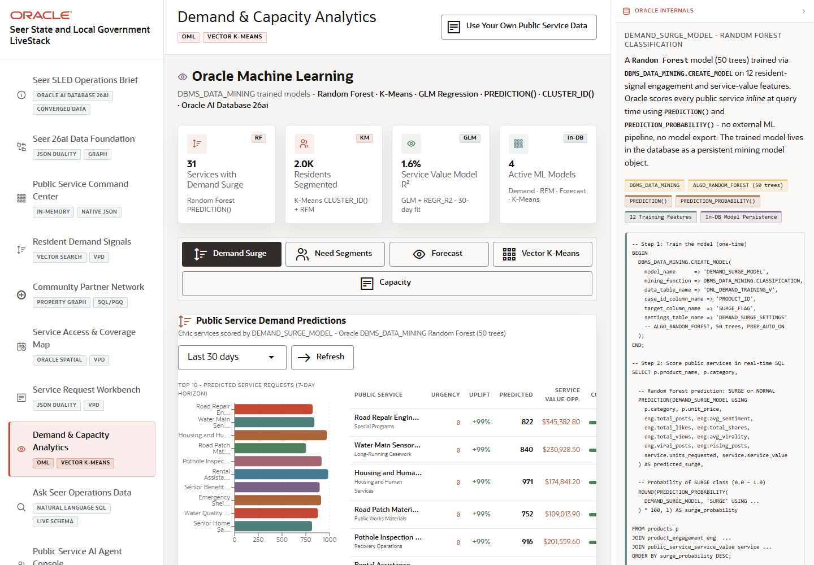

# Scene 8 Demand and Capacity Analytics

## Introduction

This scene demonstrates Oracle Machine Learning over SLED operations data. It includes demand surge prediction, resident need segmentation, service value forecasting, vector K-Means clustering, and capacity intelligence.

Estimated Time: 12 minutes

### Objectives

In this lab, you will:
- Review OML summary metrics.
- Switch between the OML analytics tabs.
- Refresh a scoring view.
- Explain the operational meaning of model outputs.

## Task 1: Review demand and segmentation models

1. Open **Demand & Capacity Analytics**.
2. Review the summary cards for services with demand surge, residents segmented, model fit, and active ML models.
3. Click **Demand Surge** and review the demand window.
4. Click **Need Segments** and inspect resident segment distribution.

Expected result:
- The user sees OML scores and segment labels directly in the application.
- The evidence panel identifies in-database model scoring and persistence rather than offline analytics.

## Task 2: Compare forecast, clustering, and capacity views

1. Click **Forecast** and adjust the forecast period if available.
2. Click **Vector K-Means** and compare cluster options.
3. Click **Capacity** and review capacity status, days of capacity, and public service value at risk.
4. Use **Refresh** in any tab to rerun the visible scoring workflow.

Expected result:
- Each tab changes the analytics view and shows a distinct OML or vector-driven decision signal.
- Capacity intelligence connects forecasted demand to service access constraints.

## Task 3: Why this matters?

Analytics become more useful when they are embedded in the operator workflow. This scene shows how SLED teams can score demand, segment residents, forecast service value, cluster services, and assess capacity without moving governed data out of Oracle.

## Credits & Build Notes
- **Author** - Oracle LiveStack Team
- **Last Updated By/Date** - Oracle LiveStack Team, 2026-05-13
- **Screenshot** - Captured from `http://158.178.146.34:8505/?page=oml`.
